# JARKOM MODUL 1 - THE WIRED

## Member K-48

| Nama | NRP |
| ---- | --- |
| Tafidah Hasna Mumtazah | 5027251025 |
| Iqbal Rizki Muhammad Fadhli | 5027251027 |

## Laporan

1. Untuk mempersiapkan pembangunan The Wired, Lain yang berperan sebagai Router membuat tiga Switch/Gateway: Switch 1 menuju dua Entitas yaitu Alice dan Mika, Switch 2 menuju Chisa, sedangkan Switch 3 menuju Knights dan Eiri. Kelima Entitas tersebut dikonfigurasi sebagai Client di GNS3.


Berikut adalah topologi jaringan yang dibangun sesuai dengan permintaan soal, dengan beberapa komponen berikut:
- **NAT**: digunakan agar router Lain dapat memperoleh IP secara dynamic (DHCP) dan terkoneksi ke internet publik.
- **Router Lain**: sebagai pusat routing yang terhubung ke NAT dan menghubungkan seluruh Switch/Gateway.
- **Switch 1, 2, dan 3**: sebagai gateway penghubung antar client yang terkoneksi ke router Lain.
- **Client (Alice, Mika, Chisa, Knights, Eiri)**: entitas yang mensimulasikan node nyata dalam topologi The Wired.

Prefix IP yang digunakan oleh kelompok kami adalah `192.235.x.x`, dengan pembagian sebagai berikut:
| Switch | Terhubung ke | Network |
| ------ | ------------ | ------- |
| Switch 1 | Alice, Mika | 192.235.1.0/24 |
| Switch 2 | Chisa | 192.235.2.0/24 |
| Switch 3 | Knights, Eiri | 192.235.3.0/24 |

2. Karena menurut Lain pada saat itu The Wired masih terisolasi dari dunia luar, konfigurasikan router Lain agar dapat tersambung langsung ke jaringan internet publik melalui NAT/DHCP pada interface eth0.

Agar router Lain dapat terkoneksi ke internet, interface `eth0` yang terhubung ke NAT dikonfigurasi untuk mendapatkan IP secara DHCP dengan mengedit Network Configuration:
```sh
auto eth0
iface eth0 inet dhcp
```
Tujuannya adalah agar interface **eth0** yang terhubung ke NAT bisa memperoleh alamat IP secara otomatis dari DHCP server.


Setelah konfigurasi diterapkan, dilakukan pengecekan menggunakan `ip a` untuk memastikan eth0 sudah mendapatkan IP dari DHCP dan bisa melakukan ping ke internet (misalnya `ping 8.8.8.8`).


3. Setelah router Lain terhubung ke internet, pastikan seluruh Entitas (Client) di bawah Switch 1, Switch 2, dan Switch 3 dapat saling terhubung dan berkomunikasi satu sama lain melalui konfigurasi routing.

Langkah pertama adalah mengonfigurasi IP pada interface router yang mengarah ke masing-masing switch, sehingga interface tersebut nantinya berperan sebagai gateway bagi client-client di bawahnya. Konfigurasi pada Network Configuration router Lain adalah sebagai berikut:

```sh
auto eth1
iface eth1 inet static
  address 192.235.1.1
  netmask 255.255.255.0

auto eth2
iface eth2 inet static
  address 192.235.2.1
  netmask 255.255.255.0

auto eth3
iface eth3 inet static
  address 192.235.3.1
  netmask 255.255.255.0
```

Interface **eth1** (Switch 1) diberi IP `192.235.1.1`, **eth2** (Switch 2) diberi IP `192.235.2.1`, dan **eth3** (Switch 3) diberi IP `192.235.3.1`.


Selanjutnya dilakukan pengecekan menggunakan `ip -br a` untuk memastikan setiap interface router sudah memiliki alokasi IP yang benar.


Setelah router selesai dikonfigurasi, setiap client diberi IP static beserta gateway sesuai switch tempat ia terhubung. Berikut konfigurasi masing-masing client:

**Alice**

```sh
auto eth0
iface eth0 inet static
  address 192.235.1.2
  netmask 255.255.255.0
  gateway 192.235.1.1
```

**Mika**

```sh
auto eth0
iface eth0 inet static
  address 192.235.1.3
  netmask 255.255.255.0
  gateway 192.235.1.1
```

**Chisa**

```sh
auto eth0
iface eth0 inet static
  address 192.235.2.2
  netmask 255.255.255.0
  gateway 192.235.2.1
```

**Knights**

```sh
auto eth0
iface eth0 inet static
  address 192.235.3.2
  netmask 255.255.255.0
  gateway 192.235.3.1
```

**Eiri**

```sh
auto eth0
iface eth0 inet static
  address 192.235.3.3
  netmask 255.255.255.0
  gateway 192.235.3.1
```

Hasil akhir konfigurasi interface pada masing-masing client dapat dilihat pada screenshot berikut:

  
 

Setelah semua interface dikonfigurasi, dilakukan pengujian ping dari masing-masing client ke seluruh client lainnya untuk membuktikan bahwa seluruh entitas sudah saling terhubung melalui routing pada router Lain.

**Alice to Others**


**Mika to Others**


**Chisa to Others**


**Knights to Others**


**Eiri to Others**


4. Lain ingin agar setiap Entitas (Client) memiliki kemandirian di The Wired. Konfigurasikan firewall/iptables (NAT Masquerade) dan DNS resolver agar setiap Client dapat terhubung ke internet secara mandiri (dapat melakukan ping ke 8.8.8.8 dan membuka domain web google.com).

Langkah pertama adalah mengecek nameserver resolving pada router Lain yang sudah terkoneksi ke NAT, melalui file `/etc/resolv.conf`:


Nameserver yang didapat `192.168.122.1` kemudian ditambahkan ke file `/etc/resolv.conf` pada masing-masing client:

```sh
nameserver 192.168.122.1
```


Selanjutnya, agar trafik dari client dapat diteruskan router menuju internet, dilakukan instalasi `iptables` pada router Lain:

```sh
apt update && apt install iptables -y
```

Setelah terinstal, menjalankan rule NAT Masquerade berikut:

```sh
iptables -t nat -A POSTROUTING -o eth0 -j MASQUERADE -s 192.235.0.0/24
```

- `iptables`: tools untuk konfigurasi inbound-outbound sebuah jaringan.
- `-t nat`: menspesifikasikan tabel NAT untuk translasi alamat.
- `-A POSTROUTING`: menambahkan rule pada chain POSTROUTING, yaitu untuk paket yang akan keluar dari sistem.
- `-o eth0`: menspesifikasikan interface keluar, yaitu eth0 yang terhubung ke NAT.
- `-j MASQUERADE`: mengganti source IP paket (dari client) menjadi IP interface eth0 router.
- `-s 192.235.0.0/24`: sumber paket yang di-masquerade, yaitu seluruh subnet The Wired.


Setelah semua konfigurasi diterapkan, dilakukan pengujian pada masing-masing client dengan melakukan ping ke `8.8.8.8` dan `google.com` untuk membuktikan bahwa setiap client sudah dapat terhubung ke internet secara mandiri.


5. Eiri tetap berupaya menanamkan kekacauan ke dalam jaringan. Untuk mengantisipasi restart tiba-tiba, pastikan seluruh konfigurasi jaringan tidak hilang saat semua node di-restart. Buat script verifikasi di `/root/cek_status.sh` pada router Lain yang menampilkan ringkasan interface (`ip -br a`) dan status tabel NAT (`iptables -t nat -L -v -n`) setelah reboot.

Agar konfigurasi tidak hilang saat node di-restart, seluruh konfigurasi interface dan iptables diletakkan pada file `/etc/rc.local` (atau `.bashrc`, tergantung image yang digunakan) sehingga otomatis diterapkan kembali setiap kali node menyala.

**Router Lain**

```sh
cat <<EOF > /etc/network/interfaces
auto eth0
iface eth0 inet dhcp

auto eth1
iface eth1 inet static
  address 192.235.1.1
  netmask 255.255.255.0

auto eth2
iface eth2 inet static
  address 192.235.2.1
  netmask 255.255.255.0

auto eth3
iface eth3 inet static
  address 192.235.3.1
  netmask 255.255.255.0
EOF

apt update
which iptables &>/dev/null || apt install iptables -y

iptables -t nat -A POSTROUTING -o eth0 -j MASQUERADE -s 192.235.0.0/24
```

**Alice** 

```sh
cat <<EOF > /etc/network/interfaces
auto eth0
iface eth0 inet static
  address 192.235.1.2
  netmask 255.255.255.0
  gateway 10.55.1.1
EOF

grep -q "nameserver 192.168.122.1" /etc/resolv.conf || echo "nameserver 192.168.122.1" >> /etc/resolv.conf
```

**Mika**

```sh
cat <<EOF > /etc/network/interfaces
auto eth0
iface eth0 inet static
  address 192.235.1.3
  netmask 255.255.255.0
  gateway 192.235.1.1
EOF

grep -q "nameserver 192.168.122.1" /etc/resolv.conf || echo "nameserver 192.168.122.1" >> /etc/resolv.conf
```

**Chisa**

```sh
cat <<EOF > /etc/network/interfaces
auto eth0
iface eth0 inet static
  address 192.235.2.2
  netmask 255.255.255.0
  gateway 192.235.2.1
EOF

grep -q "nameserver 192.168.122.1" /etc/resolv.conf || echo "nameserver 192.168.122.1" >> /etc/resolv.conf
```

**Knights** 

```sh
cat <<EOF > /etc/network/interfaces
auto eth0
iface eth0 inet static
  address 192.235.3.2
  netmask 255.255.255.0
  gateway 192.235.3.1
EOF

grep -q "nameserver 192.168.122.1" /etc/resolv.conf || echo "nameserver 192.168.122.1" >> /etc/resolv.conf
```

**Eiri** 

```sh
cat <<EOF > /etc/network/interfaces
auto eth0
iface eth0 inet static
  address 192.235.3.3
  netmask 255.255.255.0
  gateway 192.235.3.1
EOF

grep -q "nameserver 192.168.122.1" /etc/resolv.conf || echo "nameserver 192.168.122.1" >> /etc/resolv.conf
```

Selanjutnya, dibuat script verifikasi pada router Lain di `/root/cek_status.sh` untuk memastikan konfigurasi jaringan tetap ada setelah reboot:

```sh
echo "======================================="
echo " STATUS VERIFIKASI ROUTER"
echo "======================================="

echo ""
echo "--- IP Address tiap interface ---"
ip a | grep -E "eth[0-9]|inet "

echo ""
echo "--- IP Forwarding ---"
cat /proc/sys/net/ipv4/ip_forward

echo ""
echo "--- Rule NAT (iptables) ---"
iptables -t nat -L -n -v

echo ""
echo "--- Routing Table ---"
ip route

echo ""
echo "--- Test Ping ke tiap Gateway LAN ---"
ping -c 2 192.235.1.1
ping -c 2 192.235.2.1
ping -c 2 192.235.3.1

chmod +x /root/cek_status.sh
```


Setelah router Lain di-reboot, script dijalankan untuk membuktikan bahwa seluruh konfigurasi interface dan NAT masih tetap ada:

```sh
/root/cek_status.sh
```


Hasil di atas membuktikan bahwa meskipun router direstart, seluruh konfigurasi interface dan rule NAT Masquerade tetap tersimpan dan berjalan dengan baik, sehingga rencana Eiri untuk menanamkan kekacauan melalui restart tidak berhasil.

6. Mika mencurigai adanya anomali traffic pada segmen jaringannya. Jalankan generator traffic berikut pada node Mika, lalu lakukan packet sniffing menggunakan Wireshark pada interface node Mika. Terapkan display filter khusus untuk menyaring paket yang berprotokol DNS atau ICMP. Tunjukkan screenshot hasil filter beserta ringkasan paket yang lolos.

Pertama, install dependency yang dibutuhkan script generator traffic pada node Mika (Alpine Linux):

```sh
apk update
apk add bind-tools
```

Kemudian buat script generator traffic di `/root/traffic_protocol7.sh`:

```sh
cat > /root/traffic_protocol7.sh << 'EOF'
#!/bin/bash
echo "[*] Generating DNS & ICMP traffic..."
ping -c 5 8.8.8.8 &
ping -c 5 1.1.1.1 &
ping -c 3 its.ac.id &
nslookup google.com 8.8.8.8 &
nslookup its.ac.id 8.8.8.8 &
nslookup github.com 1.1.1.1 &
dig @8.8.8.8 example.com A &
dig @1.1.1.1 cloudflare.com AAAA &
wait
echo "[*] Traffic generation complete."
EOF
chmod +x /root/traffic_protocol7.sh
```

Sebelum menjalankan script, aktifkan terlebih dahulu capture Wireshark pada link **Mika ↔ Switch1** melalui GNS3 GUI (klik kanan link → Start capture). Setelah Wireshark terbuka dan aktif, jalankan script:

```sh
/root/traffic_protocol7.sh
```

Setelah script selesai, terapkan display filter berikut pada Wireshark:

```
dns or icmp
```

Berikut adalah hasil filter Wireshark yang menampilkan paket DNS query dan response:


Terlihat pada screenshot di atas berbagai paket DNS Standard query dan response untuk domain `its.ac.id`, `google.com`, `example.com`, `github.com`, dan `cloudflare.com` melalui resolver `8.8.8.8` dan `1.1.1.1`, serta paket ICMP Echo Request ke berbagai host. Berikut adalah tampilan paket ICMP yang juga tertangkap oleh filter:


Hasil filter menampilkan total **48 paket** (Packets: 54, Displayed: 48 — 88.9%) yang terdiri dari paket **ICMP** Echo Request/Reply ke `8.8.8.8` (5 pasang), `1.1.1.1` (5 pasang), dan `103.94.189.4/its.ac.id` (3 pasang) dengan 0% packet loss, serta paket **DNS** query dan response untuk resolusi berbagai domain. Hal ini membuktikan bahwa anomali traffic yang dicurigai Mika berasal dari aktivitas name resolution (DNS) dan ICMP reachability test yang berjalan secara bersamaan.

Hasil dari capture dapat dilihat [disini](captures/nomor-6-jarkom.pcapng)

7. Chisa memutuskan mendirikan FTP Server pada node miliknya dengan shared folder di `/var/wired/data`. Terapkan kebijakan akses: user alice (hak akses read & write), user mika (dibatasi read-only), dan user eiri (dibatasi tanpa izin akses / blacklist). Buktikan konfigurasi dengan membuat file signal_alice.txt dari user alice, dan buktikan penolakan akses saat user eiri mencoba login.

Pertama, dilakukan setup awal pada node Chisa dengan membuat folder shared dan user-user yang diperlukan:

```sh
mkdir -p /var/wired/data

adduser -h /var/wired/data -D alice
adduser -h /var/wired/data -D mika
adduser -D eiri

passwd alice   # alice123
passwd mika    # mika123
passwd eiri    # eiri123
```


Terlihat pada screenshot di atas proses pembuatan ketiga user beserta pengaturan password masing-masing. Selanjutnya dilakukan konfigurasi permission folder shared dan verifikasi konektivitas node Chisa:

```sh
chown alice:alice /var/wired/data
chmod 750 /var/wired/data
addgroup mika alice

echo "nameserver 8.8.8.8" > /etc/resolv.conf
ping -c 3 8.8.8.8
ping -c 3 google.com
```


Dari screenshot di atas terlihat permission folder sudah diatur dengan benar (`drwxr-s--- alice alice`) dan node Chisa sudah dapat terhubung ke internet setelah DNS resolver diset. Selanjutnya install vsftpd dan lakukan konfigurasi:

```sh
apk update
apk add vsftpd
mkdir -p /var/run/vsftpd/empty

cat > /etc/vsftpd/vsftpd.conf << 'EOF'
listen=YES
anonymous_enable=NO
local_enable=YES
write_enable=YES
chroot_local_user=YES
allow_writeable_chroot=YES
userlist_enable=YES
userlist_deny=YES
userlist_file=/etc/vsftpd/userlist
pasv_enable=YES
pasv_min_port=21000
pasv_max_port=21010
secure_chroot_dir=/var/run/vsftpd/empty
seccomp_sandbox=NO
EOF

echo "eiri" > /etc/vsftpd/userlist
```


Konfigurasi vsftpd berhasil diterapkan. Karena `userlist_deny=YES`, user yang terdaftar di `userlist_file` akan ditolak login secara langsung — maka hanya eiri yang dimasukkan ke dalam file tersebut untuk di-blacklist, sedangkan alice dan mika tidak terdaftar sehingga dapat login.

Jalankan vsftpd dan verifikasi service sudah listening di port 21 serta keanggotaan grup mika:

```sh
vsftpd /etc/vsftpd/vsftpd.conf &
netstat -tulnp 2>/dev/null | grep :21
groups mika
```


Dari hasil di atas terlihat:
- vsftpd berhasil berjalan dan listening di port 21 (PID 380: `0.0.0.0:21 LISTEN`)
- `groups mika` menampilkan `mika alice`, membuktikan mika berhasil masuk grup alice sehingga mendapat akses read-only (`r-x`) pada folder `/var/wired/data`
- Permission folder `drwxr-s---` dengan owner `alice:alice` sudah sesuai kebijakan

8. Kelompok rahasia Knights perlu mengirimkan dokumen laporan intelijen ke FTP Server Chisa. Lakukan koneksi FTP client dari node Knights ke FTP Server Chisa menggunakan akun alice. Upload file berikut. Analisis sesi Wireshark dan sebutkan: perintah FTP untuk upload (STOR), kode status sukses server (226), dan port data TCP yang dinegosiasikan pada mode PASV.

Buat file laporan intelijen pada node Knights di `/root/knights_report.txt`:

```sh
cat > /root/knights_report.txt << 'EOF'
==================================================
KNIGHTS OF THE EASTERN CALCULUS - STATUS REPORT
Protocol 7 Surveillance Network
Classification: LEVEL 7 - EYES ONLY
==================================================

Date: [CLASSIFIED]
Agent: Knights Unit Alpha
Node: Switch 3 - Subnet 192.235.3.0/24

SUBJECT: Network Reconnaissance Report

The Wired has been successfully infiltrated through
Protocol 7 channels. Current observations:

1. Router Lain has been identified as the central
   gateway node connecting all three subnet segments.

2. Switch 1 (192.235.1.0/24) hosts Alice and Mika.
3. Switch 2 (192.235.2.0/24) hosts Chisa alone.
4. Switch 3 (192.235.3.0/24) - our operational base.
   Knights and Eiri coexist on this segment.

RECOMMENDATION:
Continue monitoring FTP and Telnet sessions for
plaintext credential exposure.

END OF REPORT
Knights of the Eastern Calculus
Lets all love Lain.
EOF
```

Aktifkan capture Wireshark pada link **Knights ↔ Switch3** terlebih dahulu, kemudian upload file menggunakan `curl` dengan opsi `--disable-epsv` untuk memaksa mode PASV klasik (response `227`) bukan EPSV (`229`):

```sh
curl -v --disable-epsv \
  -T /root/knights_report.txt \
  ftp://192.235.2.2/ \
  --user alice:alice123
```


Dari output terminal di atas terlihat alur sesi FTP secara lengkap: koneksi ke `192.235.2.2:21`, login sebagai alice (`230 Login successful`), negosiasi mode PASV menghasilkan `227 Entering Passive Mode (192,235,2,2,82,11)` sehingga data channel dibuka di port `21003` (82×256+11), kemudian perintah `STOR knights_report.txt` mengirimkan 905 bytes data dan dikonfirmasi server dengan `226 Transfer complete`.

Terapkan filter Wireshark:

```
ftp or ftp-data
```


Dari list paket Wireshark terlihat urutan sesi FTP lengkap dari `220 (vsFTPd 3.0.5)` hingga `221 Goodbye`, termasuk paket `STOR knights_report.txt` (No. 25) dan paket `FTP-DATA: 905 bytes (PASV)` (No. 27). Untuk melihat seluruh sesi dalam satu tampilan linear, klik kanan paket `STOR` → **Follow** → **TCP Stream**:


Follow TCP Stream menampilkan seluruh percakapan FTP secara berurutan dari banner server hingga `221 Goodbye`, termasuk `PASV`, `227 Entering Passive Mode (192,235,2,2,82,11)`, `STOR knights_report.txt`, `150 Ok to send data`, dan `226 Transfer complete`.

Selanjutnya klik paket response `227` (No. 19) untuk melihat detail negosiasi port PASV di panel bawah Wireshark:


Wireshark secara otomatis menghitung dan menampilkan nilai port dari format `(192,235,2,2,82,11)` pada field `Passive port: 21003`. Berikut adalah detail paket FTP-DATA (No. 27) yang merupakan data channel terpisah membawa isi file di port 21003:


Terlihat pada panel bawah `Destination Port: 21003` dan `TCP Segment Len: 905` yang membuktikan transfer file berjalan melalui data channel di port hasil negosiasi PASV. Terakhir, berikut adalah paket `226 Transfer complete` (No. 32) sebagai konfirmasi akhir dari server:


Hasil analisis Wireshark:

| Item | Temuan |
|------|--------|
| Perintah upload | `STOR knights_report.txt` (Paket No. 25) |
| Kode status sukses | `226 Transfer complete` (Paket No. 32) |
| Negosiasi PASV | `227 Entering Passive Mode (192,235,2,2,82,11)` (Paket No. 19) |
| Port data TCP | **21003** (82 × 256 + 11 = 21003) |
| Transfer data | FTP-DATA: 905 bytes via port 21003 (Paket No. 27) |

9. Mika mengakses dokumen Protokol Tujuh di FTP Server Chisa. Dari node Mika, unduh file tersebut menggunakan akun mika. Setelah itu, buktikan pembatasan read-only dengan mencoba mengunggah file baru dari akun mika, dan tunjukkan pesan error respon server (error 550 Permission denied) saat mika mencoba melakukan upload.

Pertama, siapkan file `protokol_tujuh.txt` di folder shared pada node Chisa:

```sh
cat > /var/wired/data/protokol_tujuh.txt << 'EOF'
==================================================
  PROTOCOL 7 - THE MANIFESTO
  A Declaration of Digital Consciousness
  Serial Experiments Lain - Year 2026
==================================================
...
EOF

chown alice:alice /var/wired/data/protokol_tujuh.txt
chmod 640 /var/wired/data/protokol_tujuh.txt
```

Aktifkan capture Wireshark pada link **Mika ↔ Switch1** terlebih dahulu, kemudian dari node Mika jalankan download file menggunakan akun mika:

```sh
curl -v --disable-epsv \
  -u mika:mika123 \
  ftp://192.235.2.2/protokol_tujuh.txt \
  -o /root/protokol_tujuh.txt
```


Dari output terminal terlihat download berhasil: login sebagai mika (`230 Login successful`), negosiasi PASV menghasilkan port `21005`, perintah `RETR protokol_tujuh.txt` berhasil mengunduh file 1723 bytes, dan server mengonfirmasi dengan `226 Transfer complete`. Verifikasi isi file yang berhasil didownload:

```sh
cat /root/protokol_tujuh.txt
```


Isi file `protokol_tujuh.txt` berhasil ditampilkan sepenuhnya, membuktikan mika dapat membaca (read access) file dari FTP Server Chisa. Selanjutnya dilakukan percobaan upload file baru dari akun mika untuk membuktikan pembatasan read-only:

```sh
echo "mika mencoba menulis file" > /root/test_mika.txt
curl -v --disable-epsv \
  -T /root/test_mika.txt \
  ftp://192.235.2.2/ \
  --user mika:mika123
```


Server menolak upload dengan response `550 Permission denied` dan curl melaporkan `Failed FTP upload: 550`, membuktikan mika tidak memiliki hak tulis (write access) pada folder `/var/wired/data`.

Terapkan filter Wireshark:

```
ftp or ftp-data
```


Dari list paket Wireshark terlihat sesi FTP download (RETR) dari Mika ke Chisa dengan `227 Entering Passive Mode (192,235,2,2,82,14)`, perintah `RETR protokol_tujuh.txt`, dan response `150 Opening BINARY mode data connection for protokol_tujuh.txt (1723 bytes)`. Untuk melihat sesi lengkap dalam satu tampilan, berikut hasil Follow TCP Stream:


Follow TCP Stream menampilkan seluruh sesi download mika: `USER mika`, `PASS mika123`, `230 Login successful`, `PASV`, `227 Entering Passive Mode (192,235,2,2,82,14)`, `SIZE protokol_tujuh.txt`, `213 1723`, `RETR protokol_tujuh.txt`, `150 Opening BINARY mode data connection for protokol_tujuh.txt (1723 bytes)`, dan `226 Transfer complete`.

Pembatasan read-only berhasil dibuktikan: mika dapat mengunduh file dari server (RETR + 226 sukses) namun tidak dapat mengunggah file baru (STOR ditolak dengan 550). Hal ini disebabkan permission folder `/var/wired/data` yang diset `750` — grup alice yang diikuti mika hanya mendapat `r-x`, sehingga mika tidak memiliki write permission pada filesystem level.

10. Knights melancarkan uji ketahanan koneksi ke server Chisa untuk menguji latensi jaringan The Wired. Kirimkan paket ping dari node Knights ke node Chisa dengan payload khusus 128 bytes dan interval 0.3 detik sebanyak 77 paket (ping -c 77 -s 128 -i 0.3 <IP_Chisa>). Buka Wireshark, catat nilai ICMP Type dan Code untuk Echo Request vs Echo Reply, serta analisis packet loss dan RTT (min/avg/max).

Menggunakan command berikut untuk melakukan ping dari node Knights ke node Chisa (`192.235.2.2`):

```
ping -c 77 -s 128 -i 0.3 192.235.2.2
```

- -c 77 : mengirimkan sebanyak 77 packet
- -s 128 : size dari payload packet nya adalah 128 bytes
- -i 0.3 : interval antar pengiriman packet adalah 0.3 detik

Bersamaan dengan menjalankan ping tersebut, dilakukan capturing traffic menggunakan Wireshark pada koneksi antara Knights dan Chisa, kemudian diterapkan display filter `icmp` agar hanya paket ICMP yang ditampilkan.

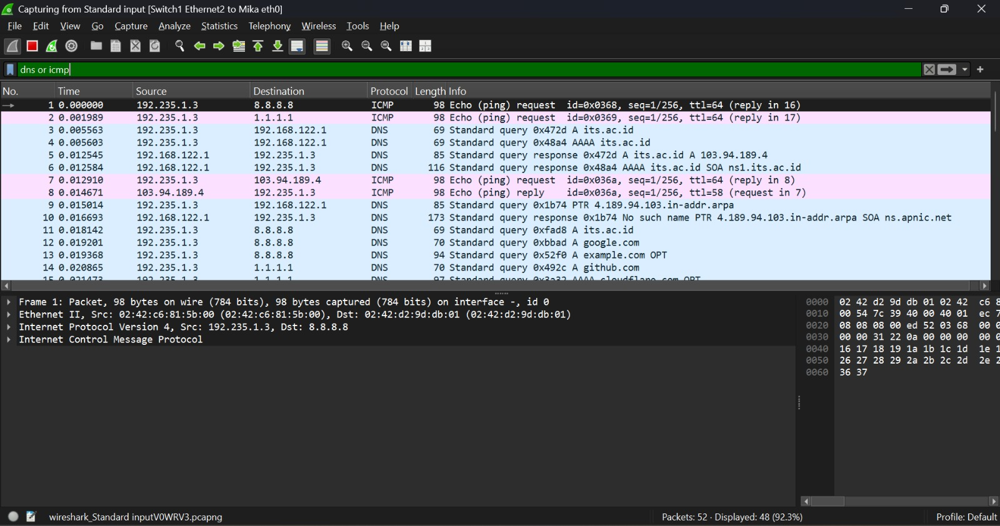

Selanjutnya adalah melihat nilai **Type** dan **Code** pada bagian *Internet Control Message Protocol* dari masing - masing paket. Berikut adalah hasil dari paket **Echo Reply** (Frame 2, dari Chisa `192.235.2.2` ke Knights `192.235.3.2`):

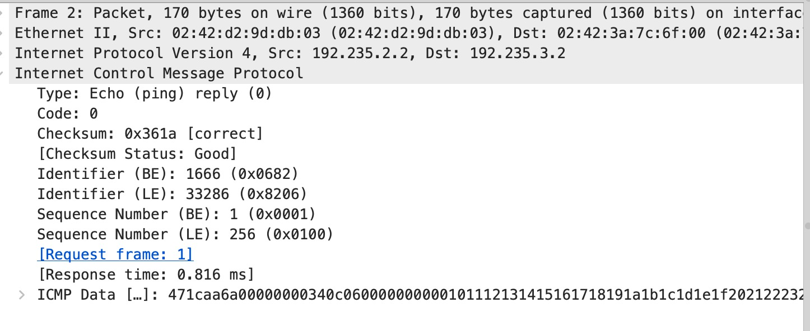

Dan berikut adalah hasil dari paket **Echo Request** (Frame 1, dari Knights ke Chisa):

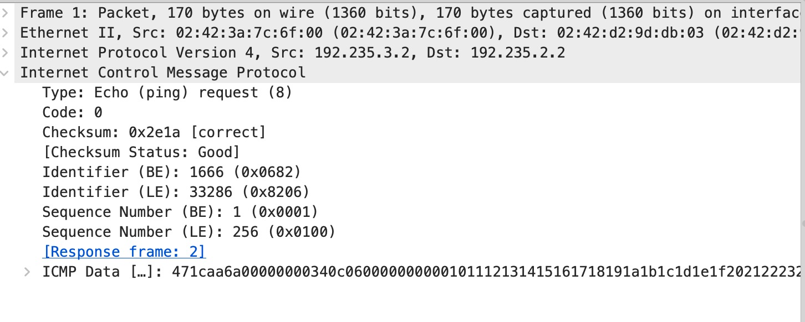

Sehingga didapatkan perbandingan nilai Type dan Code sebagai berikut:

| Jenis Paket  | ICMP Type       | ICMP Code |
| ------------ | --------------- | --------- |
| Echo Request | 8 (Echo request) | 0         |
| Echo Reply   | 0 (Echo reply)   | 0         |

Selain itu, pada paket Echo Reply terlihat bahwa ukuran paket adalah **170 bytes on wire**. Ukuran ini sesuai dengan perhitungan berikut:

- Payload : 128 bytes
- ICMP header : 8 bytes (sehingga output ping menunjukkan 136 bytes)
- IPv4 header : 20 bytes
- Ethernet II header : 14 bytes
- Total : 128 + 8 + 20 + 14 = **170 bytes**

Pada paket Echo Reply juga terlihat bahwa *Sequence Number* bernilai 1 dan merujuk ke *Request frame: 1* dengan *Response time* sebesar **0.816 ms**, yang menandakan paket reply tersebut adalah balasan dari request pertama.

Selanjutnya adalah menganalisis packet loss dan RTT dari hasil statistik ping tersebut, yang dapat dilihat pada screenshot berikut:

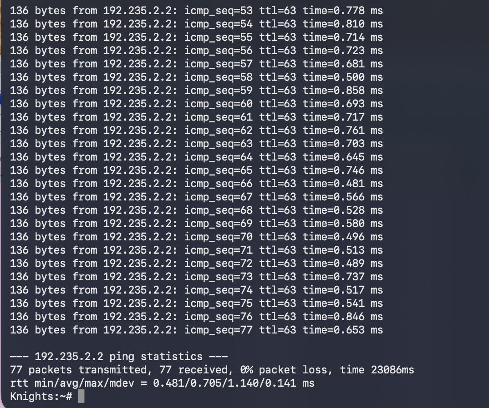

| Parameter          | Hasil                |
| ------------------ | -------------------- |
| Packet Transmitted | 77                   |
| Packet Received    | 77                   |
| Packet Loss        | 0%                   |
| Total Time         | 23086 ms             |
| RTT Min            | 0.481 ms             |
| RTT Avg            | 0.705 ms             |
| RTT Max            | 1.140 ms             |
| RTT Mdev           | 0.141 ms             |

Jika dilihat pada hasil diatas, dari 77 packet yang dikirim semuanya berhasil diterima kembali sehingga **tidak ada packet loss (0%)**. Nilai RTT juga tergolong sangat rendah dan stabil, dengan rata - rata **0.705 ms** dan selisih antara min dan max yang kecil (mdev hanya 0.141 ms), sehingga dapat disimpulkan bahwa uji ketahanan yang dilakukan Knights tidak mempengaruhi kinerja server Chisa dan koneksinya masih dalam kondisi baik.

Untuk waktu total 23086 ms juga sesuai dengan konfigurasi interval, yaitu 76 kali jeda x 0.3 detik = 22.8 detik, ditambah waktu tunggu reply terakhir. Kemudian nilai `ttl=63` pada tiap reply menunjukkan bahwa paket melewati 1 hop router (TTL awal 64 dikurangi 1) antara Knights dan Chisa, yang sesuai dengan perbedaan subnet antara `192.235.3.2` dan `192.235.2.2`.

Hasil dari capture dapat dilihat [disini](captures/nomor-10-jarkom.pcapng)

11. Buktikan kelemahan protokol Telnet dengan membuat akun phantom_user dan password wired_ghost pada layanan telnetd di node Chisa. Lakukan login Telnet dari node Eiri ke node Chisa dan tangkap sesi menggunakan Wireshark. Tunjukkan kredensial plain text melalui fitur Follow TCP Stream, serta jelaskan mengapa setiap karakter terkirim dalam paket TCP terpisah.

Untuk menerapkan simulasi ini maka pertama perlu meng-install atau melakukan setup service telnet untuk node Chisa, dapat menggunakan beberapa command berikut ini:

```
apt install openbsd-inetd telnetd -y
echo "telnet  stream  tcp     nowait  root  /usr/sbin/telnetd  telnetd" >> /etc/inetd.conf
service openbsd-inetd restart
service openbsd-inetd status
```

Dengan command diatas yaitu untuk menginstall service telnet dan melakukan konfigurasinya seharusnya sekarang telnet sudah berjalan pada node Chisa.

[](assets/telnet-success-chisa.png)

Kemudian adalah membuat user untuk login ke telnet tersebut menggunakan command dibawah ini

```
useradd -m -s /bin/bash phantom_user
echo "phantom_user:wired_ghost" | chpasswd
```

Hasilnya seperti dibawah

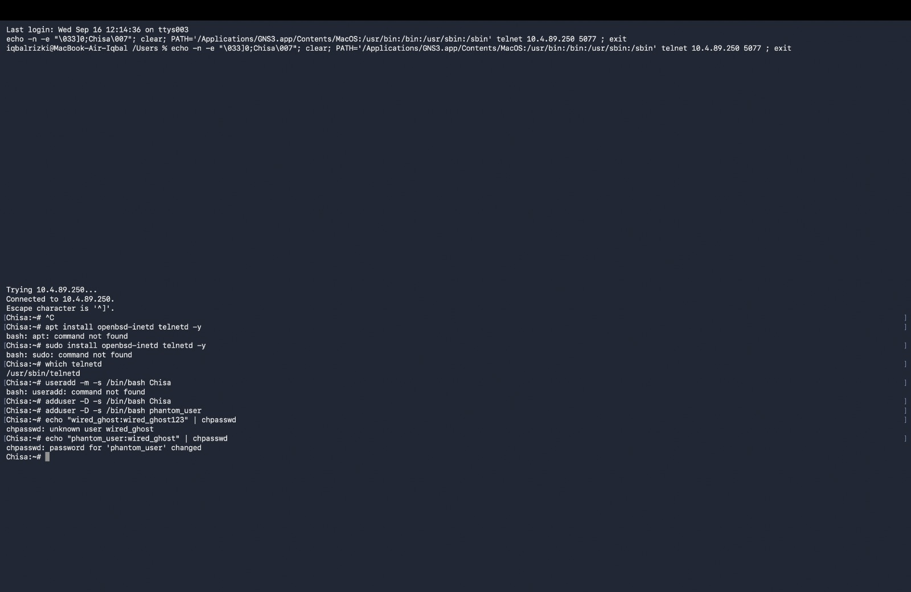

Selanjutnya adalah mencoba untuk login atau masuk ke node Chisa dari node Eiri menggunakan telnet tersebut:

```
telnet 192.235.2.2
```

Pada waktu yang bersamaan yaitu melakukan capturing traffic terhadap koneksi telnet tersebut.

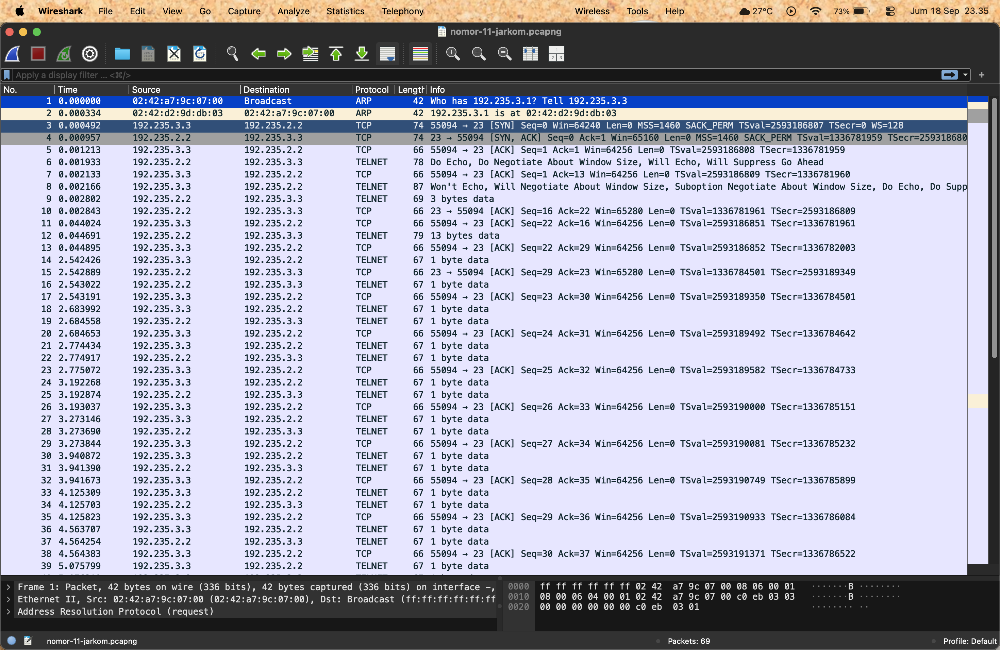

Setelah itu, terapkan display filter `telnet` lalu klik kanan pada salah satu paket dan pilih **Follow > TCP Stream**. Pada hasilnya terlihat bahwa username `phantom_user` dan password `wired_ghost` dapat terbaca sebagai plain text.

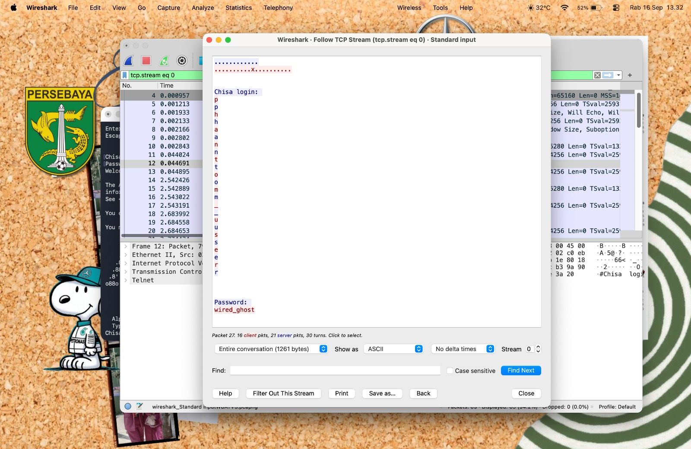

Hal ini membuktikan kelemahan protokol Telnet, yaitu seluruh data yang dikirim tidak dienkripsi sama sekali, sehingga siapapun yang berhasil menyadap jaringan dapat membaca kredensial secara langsung.

Adapun alasan mengapa setiap karakter terkirim dalam paket TCP yang terpisah adalah karena Telnet bekerja dalam mode *character-at-a-time*. Setiap kali user menekan satu tombol, karakter tersebut langsung dikirim ke server dalam satu paket TCP (dengan payload 1 byte) tanpa menunggu user menekan Enter. Server kemudian akan mengembalikan karakter tersebut sebagai *echo* (remote echo) agar tampil di terminal user, sehingga pada Wireshark terlihat banyak paket kecil berulang untuk setiap karakter, yaitu paket dari client, echo dari server, dan ACK.

Hasil dari capture dapat dilihat [disini](captures/nomor-11-jarkom.pcapng)

12. Alice mencurigai Knights menjalankan beberapa layanan rahasia di node-nya. Lakukan pemindaian port dari node Alice ke node Knights menggunakan Netcat (nc) untuk memeriksa port 22 (SSH) dan 80 (HTTP) dalam keadaan terbuka, serta port rahasia 7777 dalam keadaan tertutup. Analisis di Wireshark perbedaan TCP Flag yang dikembalikan antara port terbuka (SYN-ACK) dengan port tertutup (RST-ACK).

Pertama untuk mensimulasikan hal tersebut maka dapat membuat fake connection listening dari node Knights menggunakan *netcat*. Karena simulasi untuk port yang terbuka diharuskan port 22 dan 80 maka dari itu disini hanya melakukan listening terhadap connection tersebut. Sedangkan port 7777 sengaja tidak dilakukan listening agar berstatus tertutup.

```
nohup sh -c "nc -lvkp 22 & nc -lvkp 80 &" > /tmp/test.out 2>&1 &
```

Command diatas akan menjalankan port listening dibackground, dengan menggunakan nohup agar connection tetap persistent. Dan beberapa hal argument `-lvkp` untuk membuat connection listening terus dan tanda & agar berjalan dibackground. Hasilnya adalah dibawah ini

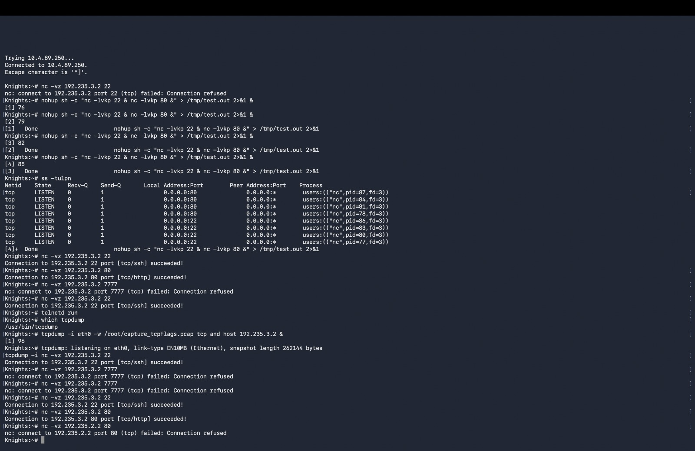

Kemudian kita bisa coba melakukan pemindaian dari node Alice ke Knights pada port - port tersebut. Menggunakan contoh command berikut ini:

```
nc -vz 192.235.3.2 22
nc -vz 192.235.3.2 80
nc -vz 192.235.3.2 7777
```

Hasilnya adalah seperti dibawah ini:

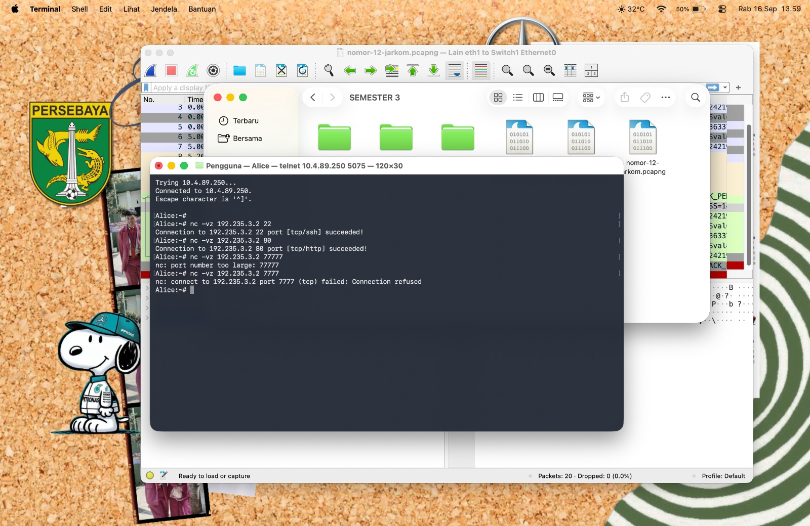

Terlihat bahwa port 22 dan 80 berstatus *open* (succeeded), sedangkan port 7777 berstatus *Connection refused* yang berarti tertutup.

Pada waktu yang bersamaan dilakukan capturing traffic pada koneksi Alice ke Knights menggunakan Wireshark, dengan display filter berikut:

```
ip.addr == 192.235.3.2 && tcp
```

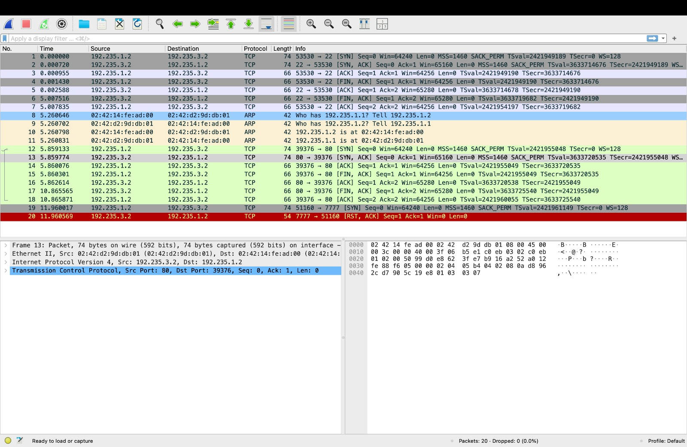

Dari hasil capture, terlihat perbedaan TCP Flag yang dikembalikan oleh Knights:

| Port | Status   | Response dari Knights | Penjelasan                                                                                             |
| ---- | -------- | --------------------- | ------------------------------------------------------------------------------------------------------ |
| 22   | Terbuka  | SYN, ACK              | Ada service yang listening, sehingga server menyetujui koneksi dan three-way handshake dilanjutkan     |
| 80   | Terbuka  | SYN, ACK              | Ada service yang listening, sehingga server menyetujui koneksi dan three-way handshake dilanjutkan     |
| 7777 | Tertutup | RST, ACK              | Tidak ada service yang listening, sehingga server langsung menolak koneksi dan me-reset percobaan SYN  |

Hasil dari capture dapat dilihat [disini](captures/nomor-12-jarkom.pcapng)

13. Lain memerintahkan agar administrasi jarak jauh menggunakan SSH secara aman tanpa password. Install OpenSSH server pada node Knights, buat pasangan kunci SSH (ssh-keygen) pada node Mika untuk user mika_admin, dan konfigurasikan public key authentication (PasswordAuthentication no). Lakukan koneksi SSH dari node Mika ke node Knights, tangkap sesi menggunakan Wireshark, identifikasi paket Protocol Version Exchange dan Key Exchange, serta jelaskan mengapa kredensial tidak terlihat dalam bentuk teks terbuka seperti pada Telnet.

Pertama yang perlu dilakukan adalah melakukan instalasi ssh server pada node Knights menggunakan command berikut ini:

```
apt install openssh-server -y
service ssh start
```

Next adalah membuat user mika_admin di node Knights (sebagai tujuan login) dan juga di node Mika (sebagai pemilik kunci)

```
useradd -m -s /bin/bash mika_admin
echo "mika_admin:mika123" | chpasswd
```

Setelah itu pada node Mika, login sebagai user mika_admin kemudian membuat pasangan kunci SSH menggunakan `ssh-keygen`

```
su - mika_admin
ssh-keygen -t ed25519
```

Dari command diatas akan terbentuk private key `~/.ssh/id_ed25519` dan public key `~/.ssh/id_ed25519.pub`. Selanjutnya public key tersebut perlu didaftarkan ke node Knights. Kemudian pada node Knights, melakukan konfigurasi agar hanya bisa login menggunakan public key authentication, yaitu dengan mengubah file `/etc/ssh/sshd_config`

```
sed -i 's/^#\?PasswordAuthentication.*/PasswordAuthentication no/' /etc/ssh/sshd_config
sed -i 's/^#\?PubkeyAuthentication.*/PubkeyAuthentication yes/' /etc/ssh/sshd_config
service ssh restart
```

- PasswordAuthentication no : menonaktifkan login menggunakan password
- PubkeyAuthentication yes : mengaktifkan login menggunakan public key

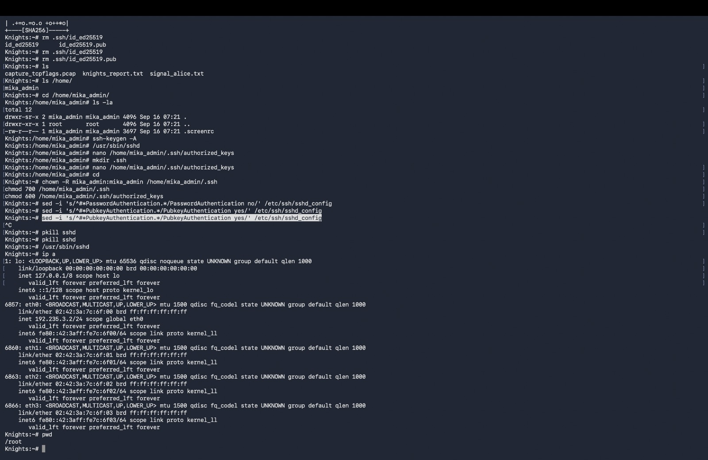

Kemudian melakukan cek koneksi apakah ssh server tersebut bisa berjalan dengan baik melalui node Mika menggunakan user mika_admin, dan login berhasil tanpa diminta password.

```
ssh mika_admin@<IP_Knights>
```

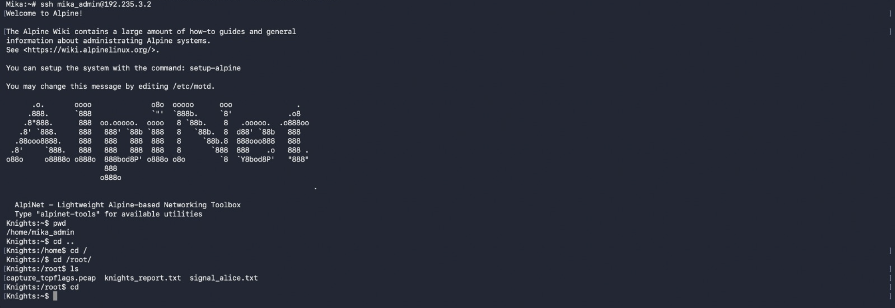

Bersamaan dengan login ke ssh Knights dapat dilakukan untuk melakukan capture connection tersebut menggunakan wireshark, dengan display filter `ssh`

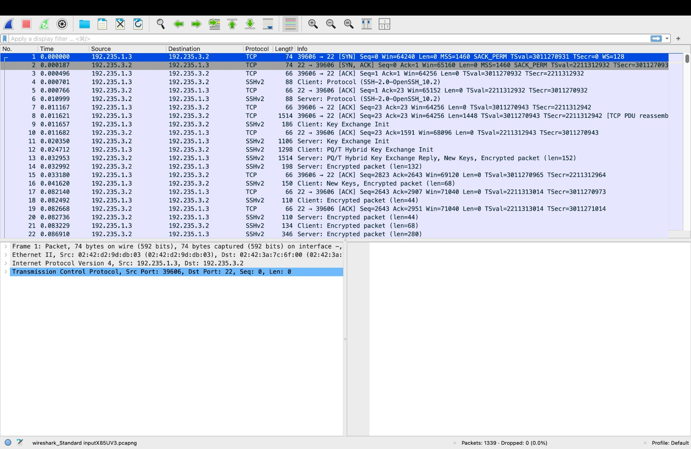

Dari hasil capture tersebut dapat diidentifikasi beberapa paket penting, yaitu:

**Protocol Version Exchange**: paket pertama dimana client dan server saling bertukar informasi versi protokol SSH yang digunakan (contoh `SSH-2.0-OpenSSH_x.x`). Paket ini masih terlihat plain text karena hanya berisi informasi versi dan belum ada data sensitif. Key Exchange, tahap dimana client dan server saling bertukar daftar algoritma (Key Exchange Init) lalu melakukan pertukaran kunci (Diffie-Hellman/ECDH Key Exchange Init dan Reply) untuk membentuk *session key* bersama, diakhiri dengan paket *New Keys* sebagai tanda enkripsi mulai diaktifkan.

Alasan mengapa kredensial tidak terlihat seperti pada Telnet adalah karena SSH mengenkripsi seluruh komunikasi setelah proses Key Exchange selesai, termasuk proses autentikasi. Berbeda dengan Telnet yang mengirim username dan password sebagai plain text, pada SSH data tersebut sudah terenkripsi dengan session key yang hanya diketahui oleh client dan server. Terlebih pada kasus ini menggunakan public key authentication, sehingga tidak ada password yang dikirim sama sekali. Private key tidak pernah meninggalkan node Mika, dan client hanya membuktikan kepemilikannya melalui tanda tangan digital (signature) yang juga terenkripsi di dalam sesi. Sehingga meskipun trafik berhasil disadap, penyerang hanya melihat data acak yang tidak dapat dibaca.

Hasil dari capture dapat dilihat [disini](captures/nomor-13-jarkom.pcapng)

14. Setelah gagal mengakses FTP, Eiri melancarkan serangan brute-force terhadap form login web Alice. Analisis file capture wired_bruteforce.pcapng untuk mengidentifikasi alamat IP penyerang, target IP beserta port yang diserang, password user lain_admin yang berhasil ditembus, serta web server software dan versi yang dilaporkan pada response header.

Buka file `wired_bruteforce.pcapng` di Wireshark. Untuk langsung menemukan percobaan login yang berhasil dari ratusan request brute-force, terapkan filter berikut:

```
http.response.code == 200
```

Hanya ditemukan **1 paket** dengan response `200 OK` dari ratusan percobaan — inilah satu-satunya kombinasi credential yang berhasil ditembus. Klik kanan paket tersebut → **Follow** → **TCP Stream** untuk melihat detail lengkap request dan response:

```
POST /login.php HTTP/1.1
Host: 172.26.7.100:8080
User-Agent: Fuzz Faster U Fool v2.1.0-dev
Content-Type: application/x-www-form-urlencoded
Content-Length: 45

username=lain_admin&password=wired_pr0tocol_7
HTTP/1.1 200 OK
Server: Apache/2.4.62
Content-Type: text/html; charset=UTF-8
Content-Length: 35
X-Powered-By: PHP/8.3.14

<h1>Success! Login successful.</h1>
```

Dari Follow TCP Stream terlihat request POST yang berhasil beserta seluruh header response server secara lengkap, termasuk identitas web server yang digunakan.

Selanjutnya dilakukan validasi temuan pada socket server:

```sh
nc 10.4.89.250 3401
```

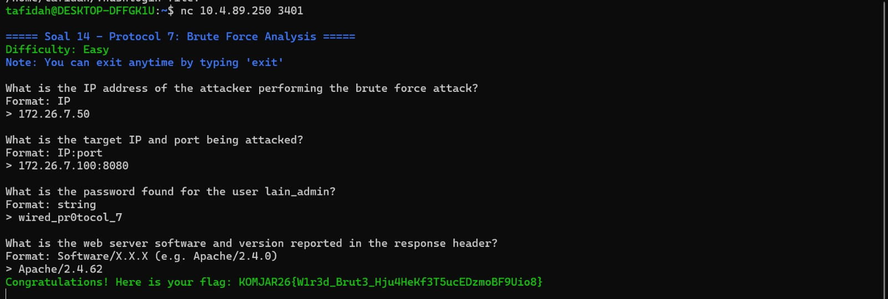

Berikut adalah hasil identifikasi lengkap beserta validasi yang telah dikonfirmasi benar oleh server:

| Item | Temuan |
|------|--------|
| IP Penyerang | `172.26.7.50` |
| Target IP:Port | `172.26.7.100:8080` |
| Password berhasil ditembus | `wired_pr0tocol_7` |
| Web Server & versi | `Apache/2.4.62` |
| Flag | `KOMJAR26{W1r3d_Brut3_Hju4HeKf3T5ucEDzmoBF9Uio8}` |

Penyerang menggunakan tool **Fuzz Faster U Fool v2.1.0-dev** (ffuf) untuk melakukan brute-force ratusan kombinasi password secara otomatis ke endpoint `/login.php` pada `172.26.7.100:8080`. Seluruh percobaan sebelumnya menghasilkan response `401 Unauthorized`, hingga akhirnya credential `lain_admin:wired_pr0tocol_7` berhasil menembus autentikasi dan server merespons dengan `200 OK` beserta body `<h1>Success! Login successful.</h1>`.

15. Eiri menyusup ke ruang server dan memasang perangkat _keyboard_ USB berbahaya pada node Alice. Dari file capture `wired_usb_hid.pcap`, identifikasi Vendor ID dan Product ID perangkat USB dari deskriptor USB, alamat nomor device USB, serta pesan rahasia yang berhasil dicuri dari keystroke. (link file) nc 10.4.89.250 3402

Analisis diawali dengan membuka file capture menggunakan `tshark` untuk mengambil Vendor ID dan Product ID dari _device descriptor_, alamat device USB dari field `usb.device_address`, serta nama perangkat dari _string descriptor_. Pada terminal yang sama, seluruh payload HID _interrupt transfer_ juga diekstrak ke sebuah file teks `hid_raw.txt` menggunakan filter `usb.capdata`.

```sh
tshark -r soal15_wired_usb_hid.pcap -Y "usb.idVendor" -T fields -e usb.idVendor -e usb.idProduct
tshark -r soal15_wired_usb_hid.pcap -Y "usb" -T fields -e usb.device_address | sort -u
tshark -r soal15_wired_usb_hid.pcap -Y "usb.bDescriptorType == 0x03" -T fields -e usb.bString
tshark -r soal15_wired_usb_hid.pcap -Y "usb.capdata" -T fields -e usb.capdata > hid_raw.txt
cat hid_raw.txt
```

Dari command tersebut didapatkan Vendor ID `0x046d` dan Product ID `0xc31c` (Logitech USB Keyboard), alamat device `7` (nilai `0` merupakan alamat _root hub_), serta nama perangkat `USB Keyboard`.

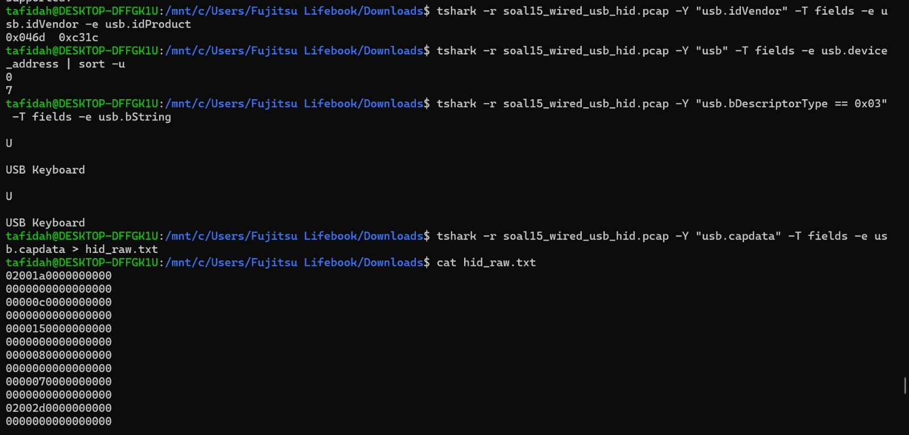

Sebelum melanjutkan proses decoding, dilakukan instalasi `python3` pada environment WSL yang digunakan.

```sh
sudo apt update && sudo apt install python3 -y
```

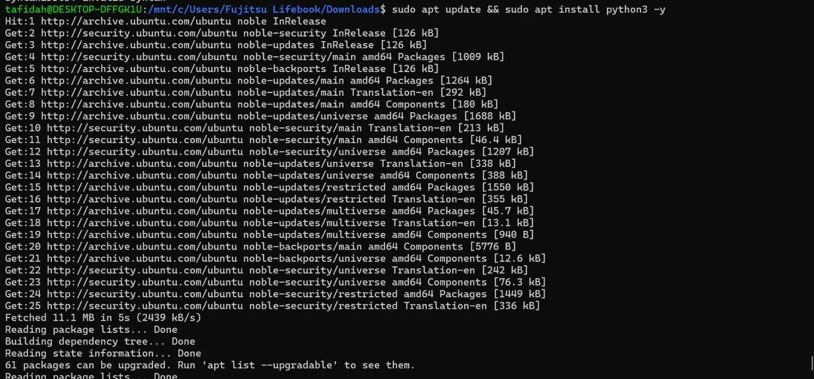

Karena setiap baris pada `hid_raw.txt` merupakan 8 byte HID report dengan keycode yang bukan berupa kode ASCII, dibuat sebuah script Python (`decode.py`) untuk melakukan mapping berdasarkan _USB HID Usage Table_ sekaligus menangani kondisi tombol _shift_.

```python
keys = {
    0x04:'a',0x05:'b',0x06:'c',0x07:'d',0x08:'e',0x09:'f',0x0a:'g',0x0b:'h',
    0x0c:'i',0x0d:'j',0x0e:'k',0x0f:'l',0x10:'m',0x11:'n',0x12:'o',0x13:'p',
    0x14:'q',0x15:'r',0x16:'s',0x17:'t',0x18:'u',0x19:'v',0x1a:'w',0x1b:'x',
    0x1c:'y',0x1d:'z',0x1e:'1',0x1f:'2',0x20:'3',0x21:'4',0x22:'5',0x23:'6',
    0x24:'7',0x25:'8',0x26:'9',0x27:'0',0x28:'\n',0x2c:' ',0x2d:'-',0x2e:'=',
    0x37:'.',0x38:'/',
}
shift_keys = {
    0x1e:'!',0x1f:'@',0x20:'#',0x21:'$',0x22:'%',0x23:'^',0x24:'&',0x25:'*',
    0x2d:'_',0x2e:'+',
}

result = ''
with open('hid_raw.txt') as f:
    for line in f:
        line = line.strip().replace(':','')
        if not line:
            continue
        data = bytes.fromhex(line)
        modifier = data[0]
        keycode = data[2]
        if keycode == 0:
            continue
        shift = modifier in (0x02, 0x20)
        if shift and keycode in shift_keys:
            result += shift_keys[keycode]
        elif keycode in keys:
            result += keys[keycode].upper() if shift else keys[keycode]

print(result)
```

Script dijalankan menggunakan `python3 decode.py` dan menghasilkan pesan rahasia `Wired_Protocol_7_is_alive_2026`.

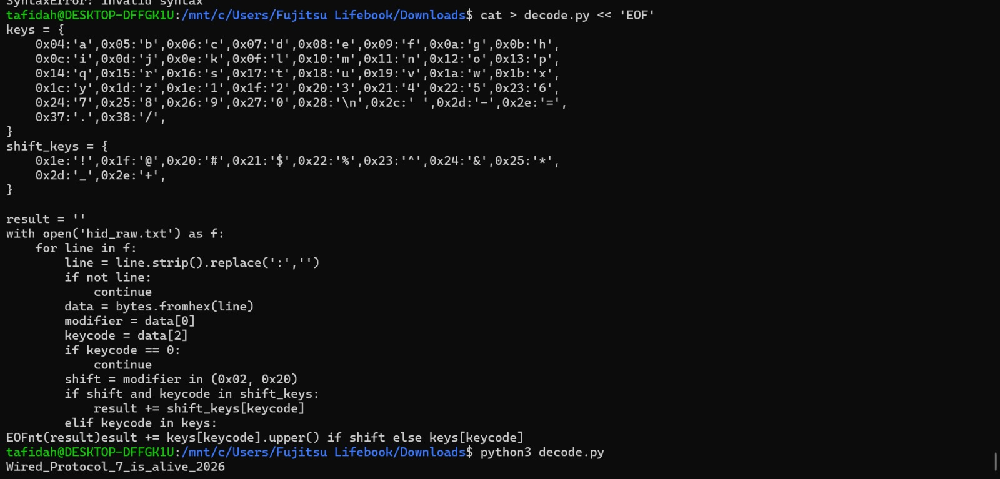

Seluruh jawaban kemudian divalidasi pada socket server `nc [IP_Group] 3402`, dan dinyatakan benar dengan diperolehnya flag.

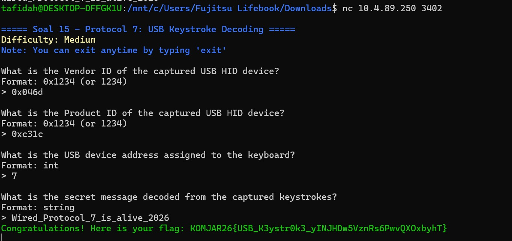

| Question                                                  | Answer                                                               |
| -------------------------------------------------------- | --------------------------------------------------------------------- |
| What is the Vendor ID of the captured USB HID device?    | 0x046d                                                                |
| What is the Product ID of the captured USB HID device?   | 0xc31c                                                                |
| What is the USB device address assigned to the keyboard? | 7                                                                     |
| What is the secret message decoded from the captured keystrokes? | Wired_Protocol_7_is_alive_2026                                |
| Flag                                                      | KOMJAR26{USB_K3ystr0k3_yINJHDw5VznRs6PwvQXOxbyhT}                     |

16. Eiri meletakkan file malware di server. Dari file capture `wired_ftp_theft.pcap`, lakukan analisis lalu lintas FTP untuk mengidentifikasi alamat IP server FTP penyerang, banner software FTP yang digunakan, kredensial login penyerang, serta ukuran (size in bytes) dari file malware `knights_payload.exe` yang diunduh. ([link file](https://drive.google.com/drive/folders/1qBeAXVx1MG14L0jzGefqs3t8qO8VRMmb?usp=sharing)) nc 10.4.89.250 3403

File capture dibuka pada Wireshark, kemudian ditemukan lebih dari satu sesi FTP pada capture tersebut. Sesi yang relevan dengan pencurian file (stream nomor 6) diverifikasi terlebih dahulu melalui `tshark`, dengan mengecek pasangan IP yang terlibat pada stream tersebut serta arah pengirim _banner_ (response kode `220`).

```sh
tshark -r soal16_wired_ftp_theft.pcapng -Y "tcp.stream == 6" -T fields -e ip.src -e ip.dst | sort -u
tshark -r soal16_wired_ftp_theft.pcapng -Y "tcp.stream == 6 && ftp.response.code == 220" -T fields -e ip.src -e ip.dst
```

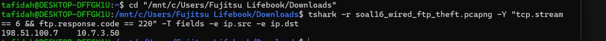
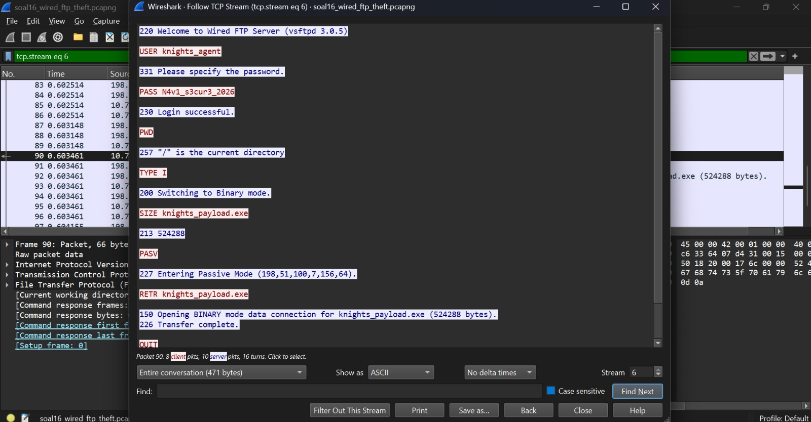

Kedua command tersebut mengonfirmasi bahwa IP server FTP yang sebenarnya adalah `198.51.100.7`, bukan `10.7.3.50` (yang merupakan IP client/attacker pada stream tersebut).

Selanjutnya, stream nomor 6 diperiksa lebih lanjut melalui **Follow → TCP Stream** pada Wireshark GUI untuk melihat rangkaian komunikasi FTP secara lengkap.

```
220 Welcome to Wired FTP Server (vsftpd 3.0.5)

USER knights_agent

331 Please specify the password.

PASS N4v1_s3cur3_2026

230 Login successful.

PWD
257 "/" is the current directory

TYPE I
200 Switching to Binary mode.

SIZE knights_payload.exe
213 524288

PASV
227 Entering Passive Mode (198,51,100,7,156,64).

RETR knights_payload.exe
150 Opening BINARY mode data connection for knights_payload.exe (524288 bytes).
226 Transfer complete.
```

Dari stream tersebut diperoleh banner software FTP `vsftpd 3.0.5`, kredensial login berupa username `knights_agent` dan password `N4v1_s3cur3_2026`. Ukuran file `knights_payload.exe` dikonfirmasi ganda, yaitu melalui response perintah `SIZE` (`213 524288`) dan melalui response perintah `RETR` (`524288 bytes`), sehingga tidak diperlukan penghitungan manual terhadap raw payload data.

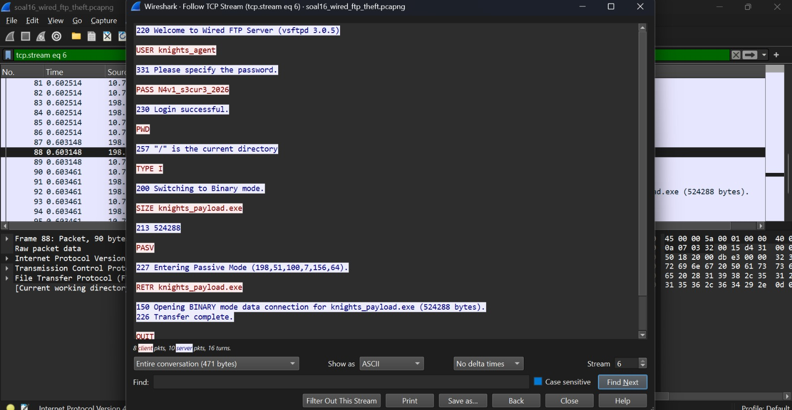

Seluruh jawaban kemudian divalidasi pada socket server `nc 10.4.89.250 3403`. Pada percobaan pertama, jawaban ukuran file sempat salah dimasukkan (`66`, hasil kesalahan baca), namun setelah dikoreksi menjadi `524288`, seluruh jawaban dinyatakan benar dan flag berhasil diperoleh.

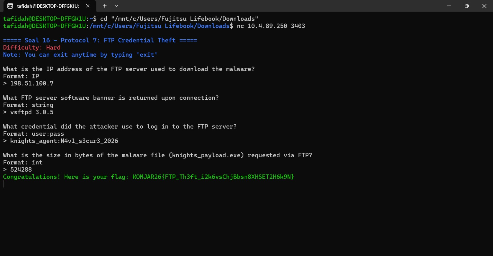

| Question                                                        | Answer                                     |
| ----------------------------------------------------------------- | --------------------------------------------- |
| What is the IP address of the FTP server used to download the malware? | 198.51.100.7                          |
| What FTP server software banner is returned upon connection?      | vsftpd 3.0.5                                 |
| What credential did the attacker use to log in to the FTP server? | knights_agent:N4v1_s3cur3_2026               |
| What is the size in bytes of the malware file (knights_payload.exe) requested via FTP? | 524288                   |
| Flag                                                               | KOMJAR26{FTP_Th3ft_XZhQWkBUEtduGuTJHhz971tyI} |

17. Alice membuat halaman web di node-nya. Eiri memanfaatkan celah untuk mengunduh payload berbahaya ke sistem Alice. Analisis file capture `wired_http_c2.pcap` untuk mengidentifikasi nama domain (Host) tempat malware diunduh, alamat IP server penyerang, nama file executable malware yang diunduh, serta kode status HTTP yang dikembalikan. ([link file](https://drive.google.com/drive/folders/1iPYESj5AN-uXYXfD2Wo2cRrm_Rigr_D6?usp=sharing)) nc 10.4.89.250 3404

File capture dianalisis menggunakan `tshark` untuk menelusuri domain yang diakses beserta IP tujuannya. Dari hasil penelusuran HTTP request sebelumnya, ditemukan bahwa file executable `navi_agent.exe` diunduh dari domain `wired-update.net`. Untuk memastikan alamat IP server penyerang, dilakukan verifikasi silang melalui dua pendekatan, yaitu resolusi DNS terhadap domain tersebut dan pengecekan `ip.dst` pada paket request file executable.

```sh
tshark -r soal17_wired_http_c2.pcapng -Y "dns.qry.name == \"wired-update.net\"" -T fields -e dns.qry.name -e dns.a
tshark -r soal17_wired_http_c2.pcapng -Y "http.request.uri == \"/navi_agent.exe\"" -T fields -e ip.src -e ip.dst
```

Kedua command tersebut sama-sama menghasilkan IP `203.0.113.42`, sehingga temuan ini dinyatakan valid dan konsisten.

Seluruh jawaban kemudian divalidasi pada socket server `nc 10.4.89.250 3404`, dan dinyatakan benar dengan diperolehnya flag.

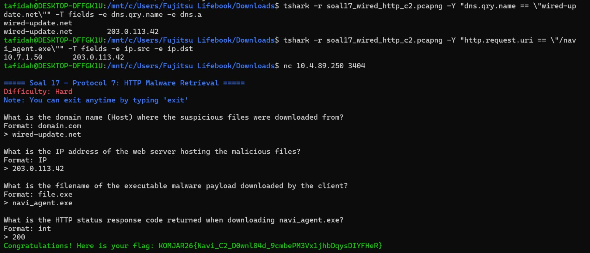

| Question                                                    | Answer                                     |
| -------------------------------------------------------------- | --------------------------------------------- |
| What is the domain name (Host) where the suspicious files were downloaded from? | wired-update.net             |
| What is the IP address of the web server hosting the malicious files? | 203.0.113.42                          |
| What is the filename of the executable malware payload downloaded by the client? | navi_agent.exe                |
| What is the HTTP status response code returned when downloading navi_agent.exe? | 200                            |
| Flag                                                            | KOMJAR26{Navi_C2_D0wnl04d_9cmbePM3Vx1jhbDqysDIYFHeR} |

18. Eiri mengubah taktik penyerangan dengan menanamkan file malware menggunakan protokol file sharing SMB. Analisis file capture `wired_smb_transfer.pcapng` untuk mengidentifikasi nama protokol jaringan yang dieksploitasi, IP pengirim dan penerima, folder tujuan penyimpanan malware pada sistem korban, serta nama file executable malware yang ditransfer. 
([link file](https://drive.google.com/file/d/1XBtKWtNM_RrSBTp2e3O5vBdiklcPNsKs/view?usp=sharing)) nc 10.4.89.250 3405

Pertama-tama file capture dibuka dan dianalisis menggunakan `tshark`. Seluruh trafik yang ada merupakan protokol **SMB2** (Server Message Block versi 2) yang berjalan di atas TCP port 445, terlihat dari rangkaian paket *Negotiate Protocol Request/Response*, *Session Setup Request/Response*, hingga **Tree Connect Request** yang menunjukkan share `\\10.7.1.50\ADMIN$` diakses.

Nama file dan path relatif tujuan diambil dari paket **Create Request** menggunakan command berikut, dan seluruh alur paket (SYN hingga Close Response) ditampilkan untuk melihat urutan lengkap transfer:

```sh
tshark -r soal18_wired_smb_transfer.pcapng -Y "smb2.filename" -T fields -e frame.number -e smb2.tree -e smb2.filename | sort -u
tshark -r soal18_wired_smb_transfer.pcapng
```

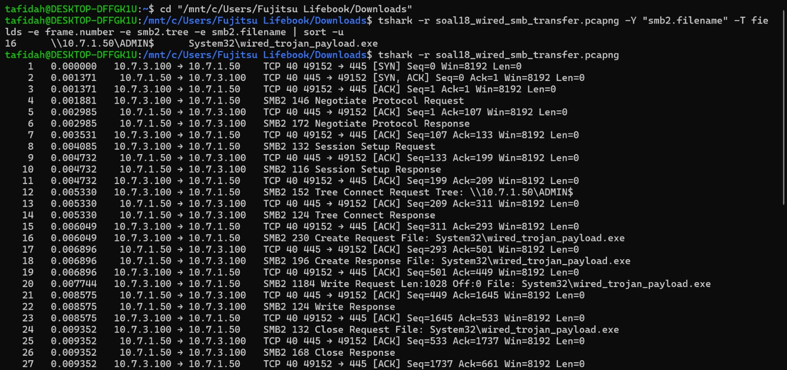

Hasil filter menunjukkan file `System32\wired_trojan_payload.exe` ditulis ke dalam share `ADMIN$`. Share `\\10.7.1.50\ADMIN$` inilah yang menjadi target directory tujuan penyimpanan malware pada sistem korban — merupakan administrative share default Windows yang memetakan langsung ke direktori instalasi sistem (`C:\Windows\`).

Transfer file dikonfirmasi berhasil melalui paket **Write Request** (berisi 1028 byte data) dan diakhiri dengan **Close Request/Response**.

Seluruh jawaban kemudian divalidasi melalui socket server dan dinyatakan benar.

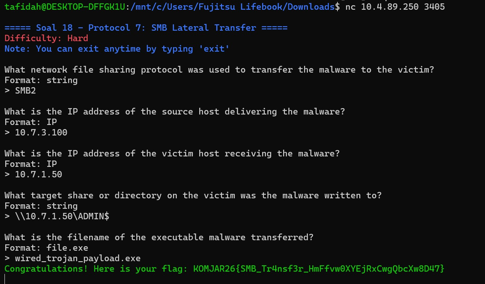

| Question | Answer |
| --- | --- |
| What network file sharing protocol was used to transfer the malware to the victim? | SMB2 |
| What is the IP address of the source host delivering the malware? | 10.7.3.100 |
| What is the IP address of the victim host receiving the malware? | 10.7.1.50 |
| What target share or directory on the victim was the malware written to? | \\10.7.1.50\ADMIN$ |
| What is the filename of the executable malware transferred? | wired_trojan_payload.exe |
| Flag | KOMJAR26{SMB_Tr4nsf3r_HmFfvw0XYEjRxCwgQbcXw8D47} |

19. Eiri meneror jaringan dengan mengirimkan email pemerasan melalui protokol SMTP tanpa enkripsi. Analisis file capture `wired_smtp_threat.pcapng` pada stream TCP terkait, identifikasi alamat email korban yang ditargetkan, password korban yang diklaim bocor oleh penyerang, jenis malware yang diinfeksikan, batas waktu (dalam hari) yang diberikan, serta MailClientID yang tercantum pada pesan.
    ([link file](https://drive.google.com/drive/folders/1RAW0cMoGDDStPyFHeJ_0t9kkoLGBsCmH?usp=sharing)) nc 10.4.89.250 3406

Capture ini ternyata berisi empat sesi SMTP berbeda yang berjalan hampir bersamaan: email internal biasa, balasan internal, email spam yang ditolak server (`550 Blocked by spam filter`), dan satu sesi dari IP eksternal yang mencurigakan. Untuk mengisolasi sesi yang relevan, dilakukan filtering berdasarkan pasangan IP sumber dan tujuan yang berada di luar jaringan internal:

```sh
tshark -r soal19_wired_smtp_threat.pcapng -Y "ip.addr == 185.234.72.19 && ip.addr == 203.0.113.100" -T fields -e tcp.stream | sort -u -n
```

Ditemukan sesi tersebut berada pada `tcp.stream 6`. Setelah stream yang tepat ditemukan, seluruh isi percakapan SMTP di-follow untuk membaca body email secara lengkap:

```sh
tshark -r soal19_wired_smtp_threat.pcapng -q -z follow,tcp,ascii,6
```

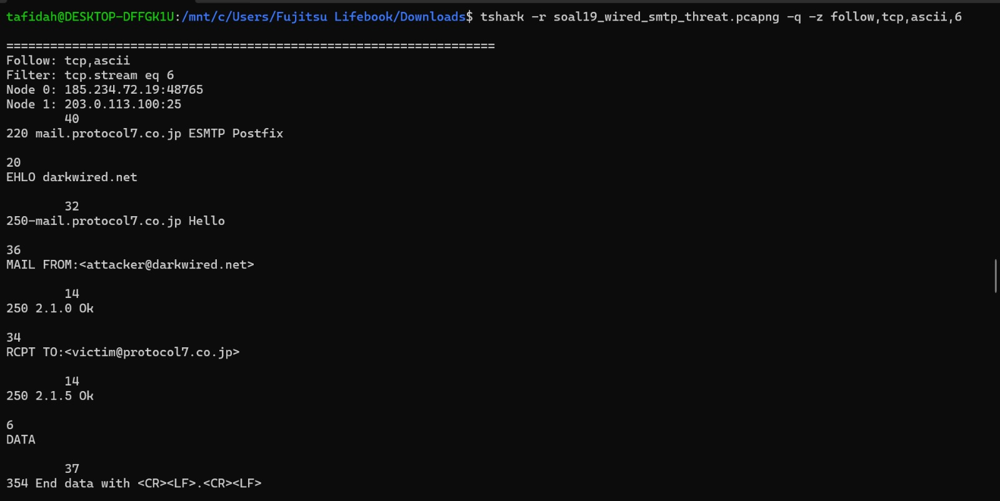

Hasil follow stream menampilkan email lengkap dari `attacker@darkwired.net` ke `victim@protocol7.co.jp` dengan subjek *"URGENT: Your Wired account has been compromised"*. Isi email berupa ancaman pemerasan bergaya ransomware, mengklaim telah membobol sistem korban dan meminta tebusan dalam Bitcoin dengan batas waktu tertentu.

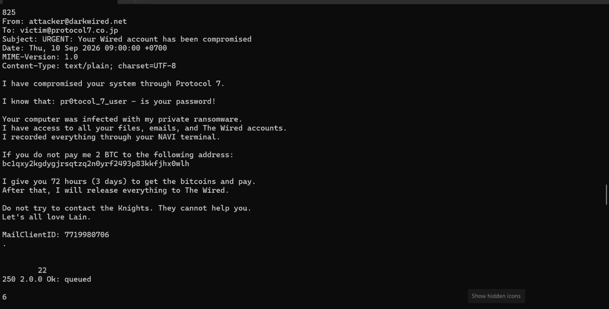

Seluruh jawaban kemudian divalidasi melalui socket server dan dinyatakan benar.

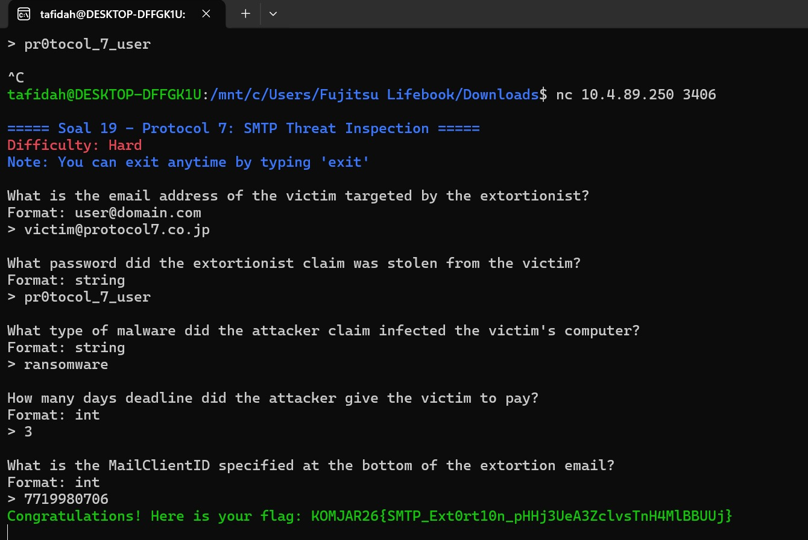

| Question | Answer |
| --- | --- |
| What is the email address of the victim targeted by the extortionist? | victim@protocol7.co.jp |
| What password did the extortionist claim was stolen from the victim? | pr0tocol_7_user |
| What type of malware did the attacker claim infected the victim's computer? | ransomware |
| How many days deadline did the attacker give the victim to pay? | 3 |
| What is the MailClientID specified at the bottom of the extortion email? | 7719980706 |
| Flag | KOMJAR26{SMTP_Ext0rt10n_pHHj3UeA3ZclvsTnH4MlBBUUj} |

20. Untuk rencana pamungkasnya, Eiri menyembunyikan komunikasi malware di balik saluran terenkripsi TLS. Namun Alice telah menyediakan file keylog untuk mendekripsi lalu lintas data tersebut. Analisis file capture `wired_tls_decrypt.pcapng` bersama `keyslogfile.txt` untuk mengidentifikasi versi protokol TLS yang dinegosiasikan, nama domain (SNI) yang diakses, alamat IP server HTTPS penyerang, User-Agent yang digunakan, serta HTTP request method dan path yang tersembunyi di dalam sesi dekripsi.
    ([link file](https://drive.google.com/file/d/1F7xN3ydIrA-pZaCb32MGseVeHKt-D_qZ/view?usp=sharing)) nc 10.4.89.250 3407

Tanpa kunci sesi, seluruh trafik pada capture ini hanya terlihat sebagai `TLSv1.2 Application Data` yang terenkripsi dan tidak dapat dibaca. Untuk mendekripsinya, file `keyslogfile.txt` didaftarkan pada Wireshark melalui menu **Edit → Preferences → Protocols → TLS**, kemudian mengisi kolom **(Pre)-Master-Secret log filename** dengan path menuju file tersebut. Setelah key log terpasang, dua paket yang sebelumnya `Application Data` otomatis ter-decode oleh Wireshark menjadi protokol `HTTP` yang dapat dibaca langsung tanpa perlu proses tambahan.

Versi TLS yang dinegosiasikan diperoleh dari kolom Protocol pada seluruh paket handshake, yaitu **TLS 1.2**. Nama domain (SNI) diperoleh dari extension `server_name` pada paket **Client Hello**, sedangkan IP server HTTPS penyerang diperoleh dari kolom Destination pada paket yang sama.

Isi request HTTP yang tersembunyi di balik saluran terenkripsi diperoleh dengan mem-follow HTTP stream setelah proses dekripsi berhasil:

```sh
tshark -r wired_tls_decrypt.pcapng -o "tls.keylog_file:keyslogfile.txt" -q -z follow,http,ascii,0
```

Hasil follow stream menunjukkan request:

```
HEAD / HTTP/1.1
Host: example.com
User-Agent: curl/7.62.0
Accept: */*
```

Seluruh jawaban kemudian divalidasi melalui socket server dan dinyatakan benar.

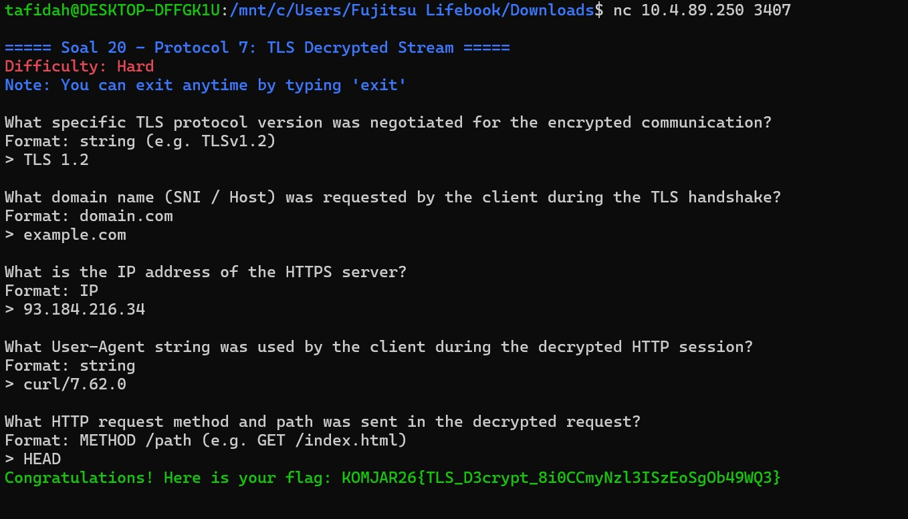

| Question | Answer |
| --- | --- |
| What specific TLS protocol version was negotiated for the encrypted communication? | TLS 1.2 |
| What domain name (SNI / Host) was requested by the client during the TLS handshake? | example.com |
| What is the IP address of the HTTPS server? | 93.184.216.34 |
| What User-Agent string was used by the client during the decrypted HTTP session? | curl/7.62.0 |
| What HTTP request method and path was sent in the decrypted request? | HEAD |
| Flag | KOMJAR26{TLS_D3crypt_8i0CCmyNzl3ISzEoSgOb49WQ3} |
