# JARKOM MODUL 1 - THE WIRED

## Member K-48

| Nama | NRP |
| ---- | --- |
| Tafidah Hasna Mumtazah | 5027251025 |
| Iqbal Rizki Muhammad Fadhli | 5027251027 |

## Laporan

1. Untuk mempersiapkan pembangunan The Wired, Lain yang berperan sebagai Router membuat tiga Switch/Gateway: Switch 1 menuju dua Entitas yaitu Alice dan Mika, Switch 2 menuju Chisa, sedangkan Switch 3 menuju Knights dan Eiri. Kelima Entitas tersebut dikonfigurasi sebagai Client di GNS3.

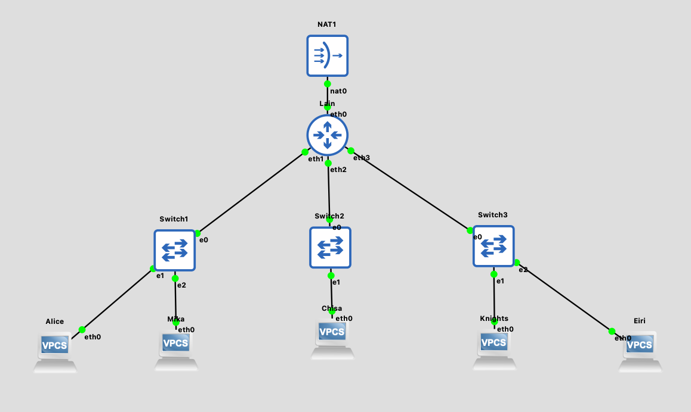

Berikut adalah topologi jaringan yang dibangun sesuai dengan permintaan soal, dengan beberapa komponen berikut:
- **NAT**: digunakan agar router Lain dapat memperoleh IP secara dynamic (DHCP) dan terkoneksi ke internet publik.
- **Router Lain**: sebagai pusat routing yang terhubung ke NAT dan menghubungkan seluruh Switch/Gateway.
- **Switch 1, 2, dan 3**: sebagai gateway penghubung antar client yang terkoneksi ke router Lain.
- **Client (Alice, Mika, Chisa, Knights, Eiri)**: entitas yang mensimulasikan node nyata dalam topologi The Wired.

Prefix IP yang digunakan oleh kelompok kami adalah `192.235.x.x`, dengan pembagian sebagai berikut:
| Switch | Terhubung ke | Network |
| ------ | ------------ | ------- |
| Switch 1 | Alice, Mika | 192.235.1.0/24 |
| Switch 2 | Chisa | 192.235.2.0/24 |
| Switch 3 | Knights, Eiri | 192.235.3.0/24 |


<br>


2. Karena menurut Lain pada saat itu The Wired masih terisolasi dari dunia luar, konfigurasikan router Lain agar dapat tersambung langsung ke jaringan internet publik melalui NAT/DHCP pada interface eth0.

Agar router Lain dapat terkoneksi ke internet, interface `eth0` yang terhubung ke NAT dikonfigurasi untuk mendapatkan IP secara DHCP dengan mengedit Network Configuration:
```sh
auto eth0
iface eth0 inet dhcp
```
Tujuannya adalah agar interface **eth0** yang terhubung ke NAT bisa memperoleh alamat IP secara otomatis dari DHCP server.

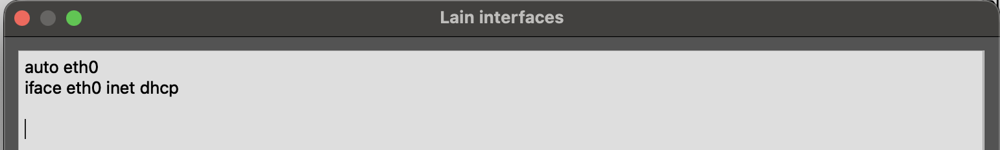

Setelah konfigurasi diterapkan, dilakukan pengecekan menggunakan `ip a` untuk memastikan eth0 sudah mendapatkan IP dari DHCP dan bisa melakukan ping ke internet (misalnya `ping 8.8.8.8`).

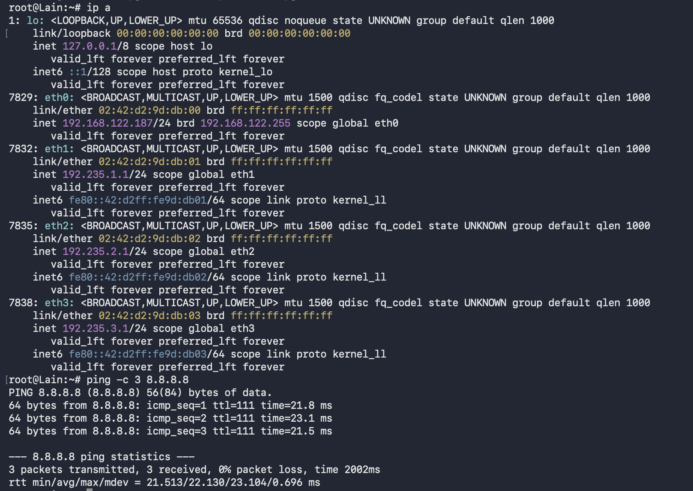


<br>


3. Setelah router Lain terhubung ke internet, pastikan seluruh Entitas (Client) di bawah Switch 1, Switch 2, dan Switch 3 dapat saling terhubung dan berkomunikasi satu sama lain melalui konfigurasi routing.

Langkah pertama adalah mengonfigurasi IP pada interface router yang mengarah ke masing-masing switch, sehingga interface tersebut nantinya berperan sebagai gateway bagi client-client di bawahnya. Konfigurasi pada Network Configuration router Lain adalah sebagai berikut:

```sh
auto eth1
iface eth1 inet static
  address 192.235.1.1
  netmask 255.255.255.0

auto eth2
iface eth2 inet static
  address 192.235.2.1
  netmask 255.255.255.0

auto eth3
iface eth3 inet static
  address 192.235.3.1
  netmask 255.255.255.0
```

Interface **eth1** (Switch 1) diberi IP `192.235.1.1`, **eth2** (Switch 2) diberi IP `192.235.2.1`, dan **eth3** (Switch 3) diberi IP `192.235.3.1`.

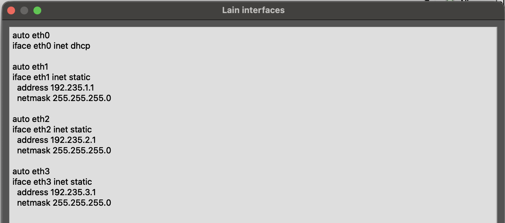

Selanjutnya dilakukan pengecekan menggunakan `ip -br a` untuk memastikan setiap interface router sudah memiliki alokasi IP yang benar.

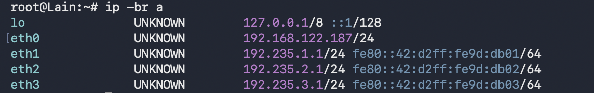

Setelah router selesai dikonfigurasi, setiap client diberi IP static beserta gateway sesuai switch tempat ia terhubung. Berikut konfigurasi masing-masing client:

**Alice**

```sh
auto eth0
iface eth0 inet static
  address 192.235.1.2
  netmask 255.255.255.0
  gateway 192.235.1.1
```

**Mika**

```sh
auto eth0
iface eth0 inet static
  address 192.235.1.3
  netmask 255.255.255.0
  gateway 192.235.1.1
```

**Chisa**

```sh
auto eth0
iface eth0 inet static
  address 192.235.2.2
  netmask 255.255.255.0
  gateway 192.235.2.1
```

**Knights**

```sh
auto eth0
iface eth0 inet static
  address 192.235.3.2
  netmask 255.255.255.0
  gateway 192.235.3.1
```

**Eiri**

```sh
auto eth0
iface eth0 inet static
  address 192.235.3.3
  netmask 255.255.255.0
  gateway 192.235.3.1
```

Hasil akhir konfigurasi interface pada masing-masing client dapat dilihat pada screenshot berikut:

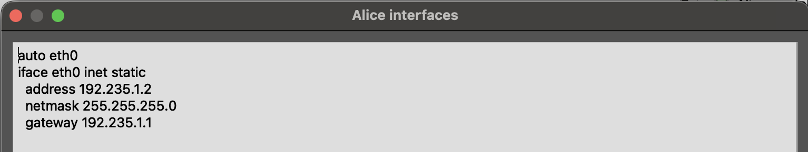 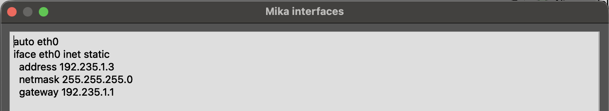 
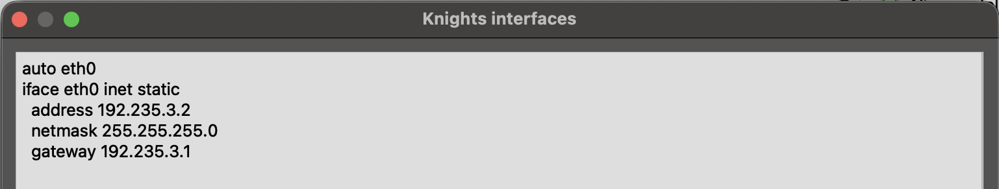 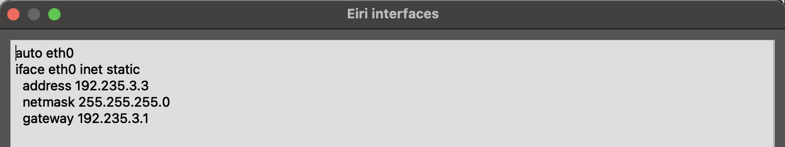

Setelah semua interface dikonfigurasi, dilakukan pengujian ping dari masing-masing client ke seluruh client lainnya untuk membuktikan bahwa seluruh entitas sudah saling terhubung melalui routing pada router Lain.

**Alice to Others**
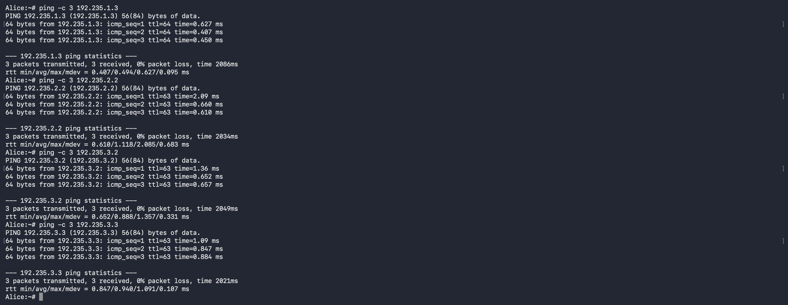

**Mika to Others**
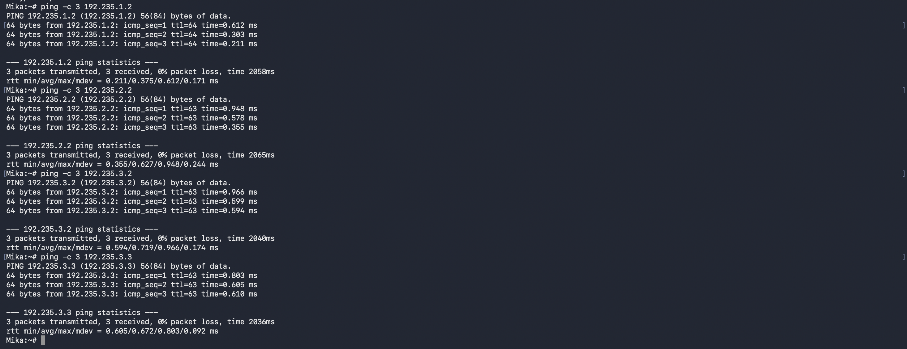

**Chisa to Others**
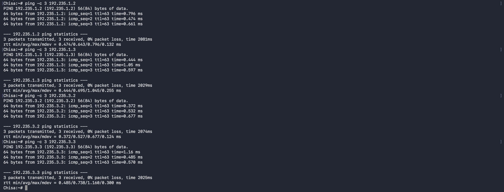

**Knights to Others**
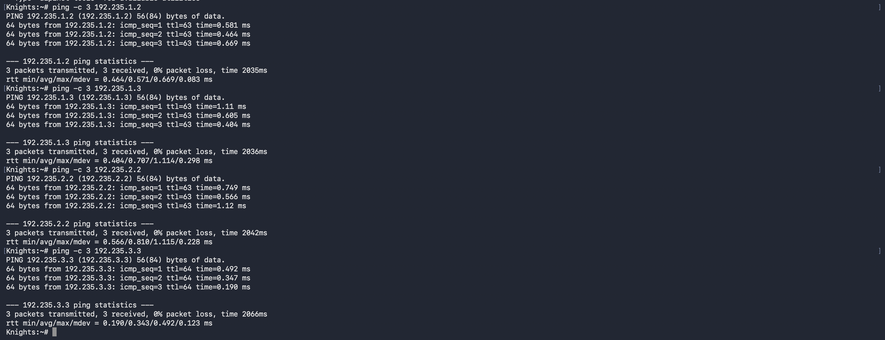

**Eiri to Others**


<br>


4. Lain ingin agar setiap Entitas (Client) memiliki kemandirian di The Wired. Konfigurasikan firewall/iptables (NAT Masquerade) dan DNS resolver agar setiap Client dapat terhubung ke internet secara mandiri (dapat melakukan ping ke 8.8.8.8 dan membuka domain web google.com).

Langkah pertama adalah mengecek nameserver resolving pada router Lain yang sudah terkoneksi ke NAT, melalui file `/etc/resolv.conf`:

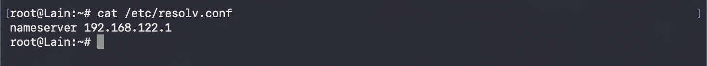

Nameserver yang didapat `192.168.122.1` kemudian ditambahkan ke file `/etc/resolv.conf` pada masing-masing client:

```sh
nameserver 192.168.122.1
```

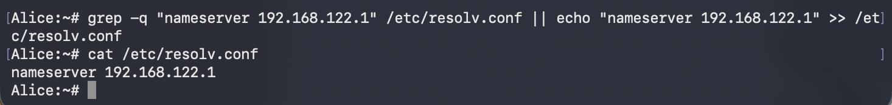
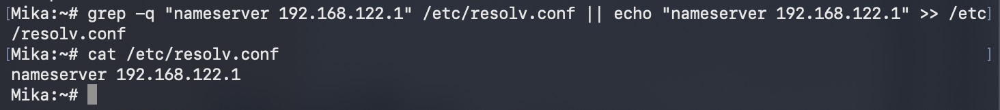
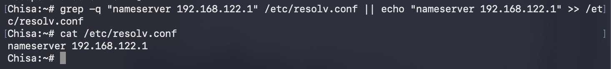
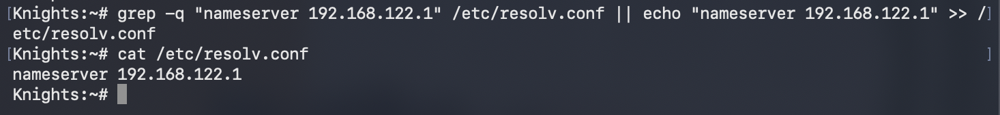
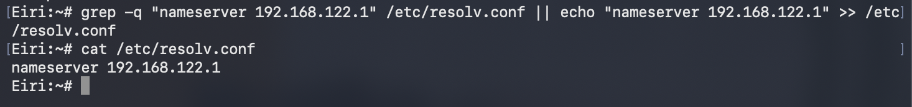

Selanjutnya, agar trafik dari client dapat diteruskan router menuju internet, dilakukan instalasi `iptables` pada router Lain:

```sh
apt update && apt install iptables -y
```

Setelah terinstal, menjalankan rule NAT Masquerade berikut:

```sh
iptables -t nat -A POSTROUTING -o eth0 -j MASQUERADE -s 192.235.0.0/24
```

- `iptables`: tools untuk konfigurasi inbound-outbound sebuah jaringan.
- `-t nat`: menspesifikasikan tabel NAT untuk translasi alamat.
- `-A POSTROUTING`: menambahkan rule pada chain POSTROUTING, yaitu untuk paket yang akan keluar dari sistem.
- `-o eth0`: menspesifikasikan interface keluar, yaitu eth0 yang terhubung ke NAT.
- `-j MASQUERADE`: mengganti source IP paket (dari client) menjadi IP interface eth0 router.
- `-s 192.235.0.0/24`: sumber paket yang di-masquerade, yaitu seluruh subnet The Wired.

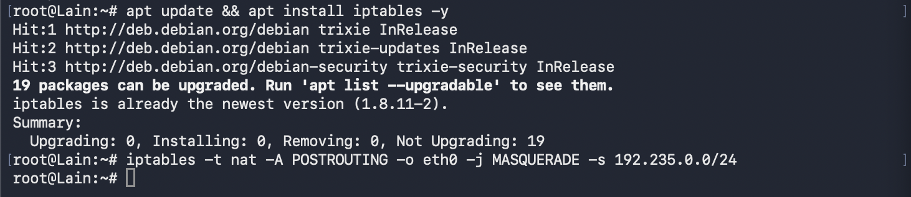

Setelah semua konfigurasi diterapkan, dilakukan pengujian pada masing-masing client dengan melakukan ping ke `8.8.8.8` dan `google.com` untuk membuktikan bahwa setiap client sudah dapat terhubung ke internet secara mandiri.

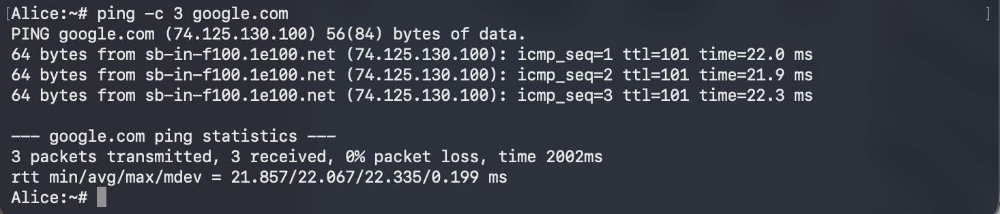
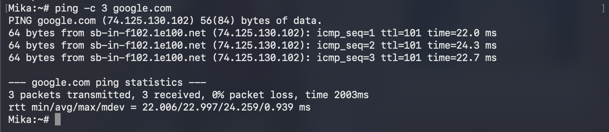
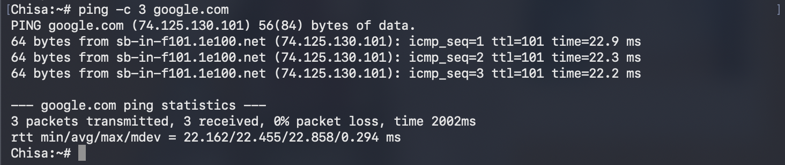
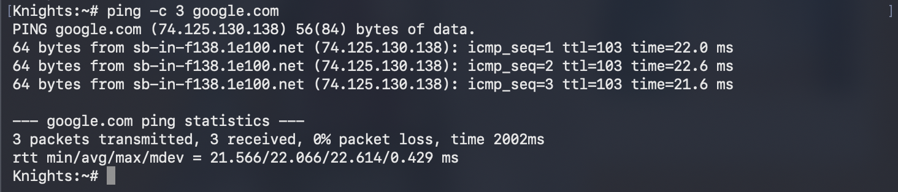
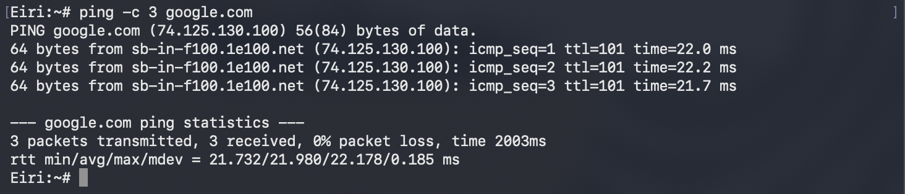


<br>


5. Eiri tetap berupaya menanamkan kekacauan ke dalam jaringan. Untuk mengantisipasi restart tiba-tiba, pastikan seluruh konfigurasi jaringan tidak hilang saat semua node di-restart. Buat script verifikasi di `/root/cek_status.sh` pada router Lain yang menampilkan ringkasan interface (`ip -br a`) dan status tabel NAT (`iptables -t nat -L -v -n`) setelah reboot.

Agar konfigurasi tidak hilang saat node di-restart, seluruh konfigurasi interface dan iptables diletakkan pada file `/etc/rc.local` (atau `.bashrc`, tergantung image yang digunakan) sehingga otomatis diterapkan kembali setiap kali node menyala.

**Router Lain**

```sh
cat <<EOF > /etc/network/interfaces
auto eth0
iface eth0 inet dhcp

auto eth1
iface eth1 inet static
  address 192.235.1.1
  netmask 255.255.255.0

auto eth2
iface eth2 inet static
  address 192.235.2.1
  netmask 255.255.255.0

auto eth3
iface eth3 inet static
  address 192.235.3.1
  netmask 255.255.255.0
EOF

apt update
which iptables &>/dev/null || apt install iptables -y

iptables -t nat -A POSTROUTING -o eth0 -j MASQUERADE -s 192.235.0.0/24
```

**Alice** 

```sh
cat <<EOF > /etc/network/interfaces
auto eth0
iface eth0 inet static
  address 192.235.1.2
  netmask 255.255.255.0
  gateway 10.55.1.1
EOF

grep -q "nameserver 192.168.122.1" /etc/resolv.conf || echo "nameserver 192.168.122.1" >> /etc/resolv.conf
```

**Mika**

```sh
cat <<EOF > /etc/network/interfaces
auto eth0
iface eth0 inet static
  address 192.235.1.3
  netmask 255.255.255.0
  gateway 192.235.1.1
EOF

grep -q "nameserver 192.168.122.1" /etc/resolv.conf || echo "nameserver 192.168.122.1" >> /etc/resolv.conf
```

**Chisa**

```sh
cat <<EOF > /etc/network/interfaces
auto eth0
iface eth0 inet static
  address 192.235.2.2
  netmask 255.255.255.0
  gateway 192.235.2.1
EOF

grep -q "nameserver 192.168.122.1" /etc/resolv.conf || echo "nameserver 192.168.122.1" >> /etc/resolv.conf
```

**Knights** 

```sh
cat <<EOF > /etc/network/interfaces
auto eth0
iface eth0 inet static
  address 192.235.3.2
  netmask 255.255.255.0
  gateway 192.235.3.1
EOF

grep -q "nameserver 192.168.122.1" /etc/resolv.conf || echo "nameserver 192.168.122.1" >> /etc/resolv.conf
```

**Eiri** 

```sh
cat <<EOF > /etc/network/interfaces
auto eth0
iface eth0 inet static
  address 192.235.3.3
  netmask 255.255.255.0
  gateway 192.235.3.1
EOF

grep -q "nameserver 192.168.122.1" /etc/resolv.conf || echo "nameserver 192.168.122.1" >> /etc/resolv.conf
```

Selanjutnya, dibuat script verifikasi pada router Lain di `/root/cek_status.sh` untuk memastikan konfigurasi jaringan tetap ada setelah reboot:

```sh
echo "======================================="
echo " STATUS VERIFIKASI ROUTER"
echo "======================================="

echo ""
echo "--- IP Address tiap interface ---"
ip a | grep -E "eth[0-9]|inet "

echo ""
echo "--- IP Forwarding ---"
cat /proc/sys/net/ipv4/ip_forward

echo ""
echo "--- Rule NAT (iptables) ---"
iptables -t nat -L -n -v

echo ""
echo "--- Routing Table ---"
ip route

echo ""
echo "--- Test Ping ke tiap Gateway LAN ---"
ping -c 2 192.235.1.1
ping -c 2 192.235.2.1
ping -c 2 192.235.3.1

chmod +x /root/cek_status.sh
```

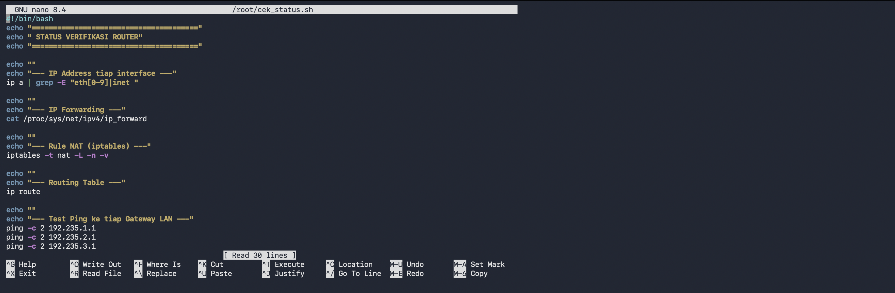

Setelah router Lain di-reboot, script dijalankan untuk membuktikan bahwa seluruh konfigurasi interface dan NAT masih tetap ada:

```sh
/root/cek_status.sh
```

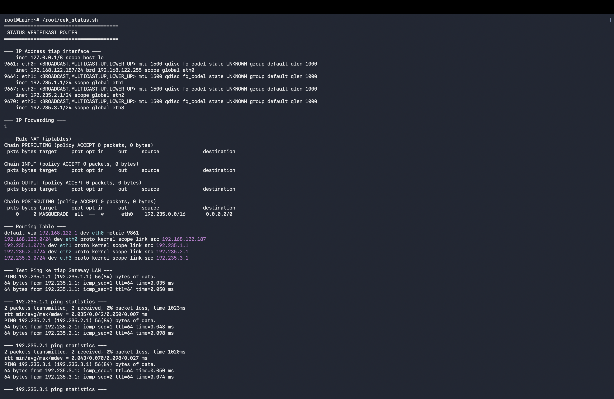

Hasil di atas membuktikan bahwa meskipun router direstart, seluruh konfigurasi interface dan rule NAT Masquerade tetap tersimpan dan berjalan dengan baik, sehingga rencana Eiri untuk menanamkan kekacauan melalui restart tidak berhasil.


<br>


10. Knights melancarkan uji ketahanan koneksi ke server Chisa untuk menguji latensi jaringan The Wired. Kirimkan paket ping dari node Knights ke node Chisa dengan payload khusus 128 bytes dan interval 0.3 detik sebanyak 77 paket (ping -c 77 -s 128 -i 0.3 <IP_Chisa>). Buka Wireshark, catat nilai ICMP Type dan Code untuk Echo Request vs Echo Reply, serta analisis packet loss dan RTT (min/avg/max).

Menggunakan command berikut untuk melakukan ping dari node Knights ke node Chisa (`192.235.2.2`):

```
ping -c 77 -s 128 -i 0.3 192.235.2.2
```

- -c 77 : mengirimkan sebanyak 77 packet
- -s 128 : size dari payload packet nya adalah 128 bytes
- -i 0.3 : interval antar pengiriman packet adalah 0.3 detik

Bersamaan dengan menjalankan ping tersebut, dilakukan capturing traffic menggunakan Wireshark pada koneksi antara Knights dan Chisa, kemudian diterapkan display filter `icmp` agar hanya paket ICMP yang ditampilkan.

[](assets/capture-icmp-knights-chisa.png)

Selanjutnya adalah melihat nilai **Type** dan **Code** pada bagian *Internet Control Message Protocol* dari masing - masing paket. Berikut adalah hasil dari paket **Echo Reply** (Frame 2, dari Chisa `192.235.2.2` ke Knights `192.235.3.2`):

[](assets/icmp-echo-reply.png)

Dan berikut adalah hasil dari paket **Echo Request** (Frame 1, dari Knights ke Chisa):

[](assets/icmp-echo-request.png)

Sehingga didapatkan perbandingan nilai Type dan Code sebagai berikut:

| Jenis Paket  | ICMP Type       | ICMP Code |
| ------------ | --------------- | --------- |
| Echo Request | 8 (Echo request) | 0         |
| Echo Reply   | 0 (Echo reply)   | 0         |

Selain itu, pada paket Echo Reply terlihat bahwa ukuran paket adalah **170 bytes on wire**. Ukuran ini sesuai dengan perhitungan berikut:

- Payload : 128 bytes
- ICMP header : 8 bytes (sehingga output ping menunjukkan 136 bytes)
- IPv4 header : 20 bytes
- Ethernet II header : 14 bytes
- Total : 128 + 8 + 20 + 14 = **170 bytes**

Pada paket Echo Reply juga terlihat bahwa *Sequence Number* bernilai 1 dan merujuk ke *Request frame: 1* dengan *Response time* sebesar **0.816 ms**, yang menandakan paket reply tersebut adalah balasan dari request pertama.

Selanjutnya adalah menganalisis packet loss dan RTT dari hasil statistik ping tersebut, yang dapat dilihat pada screenshot berikut:

[](assets/ping-statistics-knights-chisa.png)

| Parameter          | Hasil                |
| ------------------ | -------------------- |
| Packet Transmitted | 77                   |
| Packet Received    | 77                   |
| Packet Loss        | 0%                   |
| Total Time         | 23086 ms             |
| RTT Min            | 0.481 ms             |
| RTT Avg            | 0.705 ms             |
| RTT Max            | 1.140 ms             |
| RTT Mdev           | 0.141 ms             |

Jika dilihat pada hasil diatas, dari 77 packet yang dikirim semuanya berhasil diterima kembali sehingga **tidak ada packet loss (0%)**. Nilai RTT juga tergolong sangat rendah dan stabil, dengan rata - rata **0.705 ms** dan selisih antara min dan max yang kecil (mdev hanya 0.141 ms), sehingga dapat disimpulkan bahwa uji ketahanan yang dilakukan Knights tidak mempengaruhi kinerja server Chisa dan koneksinya masih dalam kondisi baik.

Untuk waktu total 23086 ms juga sesuai dengan konfigurasi interval, yaitu 76 kali jeda x 0.3 detik = 22.8 detik, ditambah waktu tunggu reply terakhir. Kemudian nilai `ttl=63` pada tiap reply menunjukkan bahwa paket melewati 1 hop router (TTL awal 64 dikurangi 1) antara Knights dan Chisa, yang sesuai dengan perbedaan subnet antara `192.235.3.2` dan `192.235.2.2`.

Hasil dari capture dapat dilihat [disini](captures/capture-knights-chisa-ping.pcapng)


<br>


11. Buktikan kelemahan protokol Telnet dengan membuat akun phantom_user dan password wired_ghost pada layanan telnetd di node Chisa. Lakukan login Telnet dari node Eiri ke node Chisa dan tangkap sesi menggunakan Wireshark. Tunjukkan kredensial plain text melalui fitur Follow TCP Stream, serta jelaskan mengapa setiap karakter terkirim dalam paket TCP terpisah.

Untuk menerapkan simulasi ini maka pertama perlu meng-install atau melakukan setup service telnet untuk node Chisa, dapat menggunakan beberapa command berikut ini:

```
apt install openbsd-inetd telnetd -y
echo "telnet  stream  tcp     nowait  root  /usr/sbin/telnetd  telnetd" >> /etc/inetd.conf
service openbsd-inetd restart
service openbsd-inetd status
```

Dengan command diatas yaitu untuk menginstall service telnet dan melakukan konfigurasinya seharusnya sekarang telnet sudah berjalan pada node Chisa.

[](assets/telnet-success-chisa.png)

Kemudian adalah membuat user untuk login ke telnet tersebut menggunakan command dibawah ini

```
useradd -m -s /bin/bash phantom_user
echo "phantom_user:wired_ghost" | chpasswd
```

Hasilnya seperti dibawah

[](assets/new-user-phantom.png)

Selanjutnya adalah mencoba untuk login atau masuk ke node Chisa dari node Eiri menggunakan telnet tersebut, proof nya ada di screenshot berikut ini:

```
telnet <IP_Chisa>
```

[](assets/eiri-telnet-chisa.png)

Pada waktu yang bersamaan yaitu melakukan capturing traffic terhadap koneksi telnet tersebut.

[](assets/capture-eiri-to-chisa.png)

Setelah itu, terapkan display filter `telnet` lalu klik kanan pada salah satu paket dan pilih **Follow > TCP Stream**. Pada hasilnya terlihat bahwa username `phantom_user` dan password `wired_ghost` dapat terbaca sebagai plain text.

[](assets/follow-tcp-stream-telnet.png)

Hal ini membuktikan kelemahan protokol Telnet, yaitu seluruh data yang dikirim tidak dienkripsi sama sekali, sehingga siapapun yang berhasil menyadap jaringan dapat membaca kredensial secara langsung.

Adapun alasan mengapa setiap karakter terkirim dalam paket TCP yang terpisah adalah karena Telnet bekerja dalam mode *character-at-a-time*. Setiap kali user menekan satu tombol, karakter tersebut langsung dikirim ke server dalam satu paket TCP (dengan payload 1 byte) tanpa menunggu user menekan Enter. Server kemudian akan mengembalikan karakter tersebut sebagai *echo* (remote echo) agar tampil di terminal user, sehingga pada Wireshark terlihat banyak paket kecil berulang untuk setiap karakter, yaitu paket dari client, echo dari server, dan ACK.

[](assets/telnet-single-char-packets.png)

Hasil dari capture dapat dilihat [disini](captures/capture-eiri-telnet-chisa.pcapng)


<br>


12. Alice mencurigai Knights menjalankan beberapa layanan rahasia di node-nya. Lakukan pemindaian port dari node Alice ke node Knights menggunakan Netcat (nc) untuk memeriksa port 22 (SSH) dan 80 (HTTP) dalam keadaan terbuka, serta port rahasia 7777 dalam keadaan tertutup. Analisis di Wireshark perbedaan TCP Flag yang dikembalikan antara port terbuka (SYN-ACK) dengan port tertutup (RST-ACK).

Pertama untuk mensimulasikan hal tersebut maka dapat membuat fake connection listening dari node Knights menggunakan *netcat*. Karena simulasi untuk port yang terbuka diharuskan port 22 dan 80 maka dari itu disini hanya melakukan listening terhadap connection tersebut. Sedangkan port 7777 sengaja tidak dilakukan listening agar berstatus tertutup.

```
nohup sh -c "nc -lvkp 22 & nc -lvkp 80 &" > /tmp/test.out 2>&1 &
```

Command diatas akan menjalankan port listening dibackground, dengan menggunakan nohup agar connection tetap persistent. Dan beberapa hal argument `-lvkp` untuk membuat connection listening terus dan tanda & agar berjalan dibackground. Hasilnya adalah dibawah ini

[](assets/listening-port-knights.png)

Kemudian kita bisa coba melakukan pemindaian dari node Alice ke Knights pada port - port tersebut. Menggunakan contoh command berikut ini:

```
nc -vz <IP_Knights> 22
nc -vz <IP_Knights> 80
nc -vz <IP_Knights> 7777
```

Hasilnya adalah seperti dibawah ini:

[](assets/alice-nc-to-knights.png)

Terlihat bahwa port 22 dan 80 berstatus *open* (succeeded), sedangkan port 7777 berstatus *Connection refused* yang berarti tertutup.

Pada waktu yang bersamaan dilakukan capturing traffic pada koneksi Alice ke Knights menggunakan Wireshark, dengan display filter berikut:

```
ip.addr == <IP_Knights> && tcp
```

[](assets/capture-alice-scan-knights.png)

Selanjutnya untuk membedakan response dari port terbuka dan tertutup, dapat memanfaatkan display filter berikut:

```
tcp.flags.syn == 1 && tcp.flags.ack == 1
tcp.flags.reset == 1
```

Dari hasil capture, terlihat perbedaan TCP Flag yang dikembalikan oleh Knights:

| Port | Status   | Response dari Knights | Penjelasan                                                                                             |
| ---- | -------- | --------------------- | ------------------------------------------------------------------------------------------------------ |
| 22   | Terbuka  | SYN, ACK              | Ada service yang listening, sehingga server menyetujui koneksi dan three-way handshake dilanjutkan     |
| 80   | Terbuka  | SYN, ACK              | Ada service yang listening, sehingga server menyetujui koneksi dan three-way handshake dilanjutkan     |
| 7777 | Tertutup | RST, ACK              | Tidak ada service yang listening, sehingga server langsung menolak koneksi dan me-reset percobaan SYN  |

[](assets/tcp-synack-open-port.png)
[](assets/tcp-rstack-closed-port.png)

Hasil dari capture dapat dilihat [disini](captures/capture-alice-portscan-knights.pcapng)


<br>


13. Lain memerintahkan agar administrasi jarak jauh menggunakan SSH secara aman tanpa password. Install OpenSSH server pada node Knights, buat pasangan kunci SSH (ssh-keygen) pada node Mika untuk user mika_admin, dan konfigurasikan public key authentication (PasswordAuthentication no). Lakukan koneksi SSH dari node Mika ke node Knights, tangkap sesi menggunakan Wireshark, identifikasi paket Protocol Version Exchange dan Key Exchange, serta jelaskan mengapa kredensial tidak terlihat dalam bentuk teks terbuka seperti pada Telnet.

Pertama yang perlu dilakukan adalah melakukan instalasi ssh server pada node Knights menggunakan command berikut ini:

```
apt install openssh-server -y
service ssh start
```

Setelah command diatas dijalankan maka seharusnya ssh server sudah berjalan di node Knights, terlihat pada screenshot dibawah ini:

[](assets/install-ssh-knights.png)

Next adalah membuat user mika_admin di node Knights (sebagai tujuan login) dan juga di node Mika (sebagai pemilik kunci)

```
useradd -m -s /bin/bash mika_admin
echo "mika_admin:mika123" | chpasswd
```

[](assets/new-user-mika-admin.png)

Setelah itu pada node Mika, login sebagai user mika_admin kemudian membuat pasangan kunci SSH menggunakan `ssh-keygen`

```
su - mika_admin
ssh-keygen -t ed25519
```

[](assets/ssh-keygen-mika.png)

Dari command diatas akan terbentuk private key `~/.ssh/id_ed25519` dan public key `~/.ssh/id_ed25519.pub`. Selanjutnya public key tersebut perlu didaftarkan ke node Knights, yaitu dengan command berikut (dilakukan sebelum password authentication dimatikan):

```
ssh-copy-id mika_admin@<IP_Knights>
```

[](assets/ssh-copy-id-mika.png)

Kemudian pada node Knights, melakukan konfigurasi agar hanya bisa login menggunakan public key authentication, yaitu dengan mengubah file `/etc/ssh/sshd_config`

```
sed -i 's/^#\?PasswordAuthentication.*/PasswordAuthentication no/' /etc/ssh/sshd_config
sed -i 's/^#\?PubkeyAuthentication.*/PubkeyAuthentication yes/' /etc/ssh/sshd_config
service ssh restart
```

- PasswordAuthentication no : menonaktifkan login menggunakan password
- PubkeyAuthentication yes : mengaktifkan login menggunakan public key

[](assets/sshd-config-knights.png)

Kemudian melakukan cek koneksi apakah ssh server tersebut bisa berjalan dengan baik melalui node Mika menggunakan user mika_admin, dan login berhasil tanpa diminta password.

```
ssh mika_admin@<IP_Knights>
```

[](assets/mika-ssh-knights.png)

Bersamaan dengan login ke ssh Knights dapat dilakukan untuk melakukan capture connection tersebut menggunakan wireshark, dengan display filter `ssh`

[](assets/capture-mika-ssh-knights.png)

Dari hasil capture tersebut dapat diidentifikasi beberapa paket penting, yaitu:

- **Protocol Version Exchange**: paket pertama dimana client dan server saling bertukar informasi versi protokol SSH yang digunakan (contoh `SSH-2.0-OpenSSH_x.x`). Paket ini masih terlihat plain text karena hanya berisi informasi versi dan belum ada data sensitif.

[](assets/ssh-protocol-version-exchange.png)

- **Key Exchange**: tahap dimana client dan server saling bertukar daftar algoritma (Key Exchange Init) lalu melakukan pertukaran kunci (Diffie-Hellman/ECDH Key Exchange Init dan Reply) untuk membentuk *session key* bersama, diakhiri dengan paket *New Keys* sebagai tanda enkripsi mulai diaktifkan.

[](assets/ssh-key-exchange.png)

Setelah paket *New Keys*, semua paket berikutnya hanya tampil sebagai *Encrypted packet*.

[](assets/ssh-encrypted-packet.png)

Alasan mengapa kredensial tidak terlihat seperti pada Telnet adalah karena SSH mengenkripsi seluruh komunikasi setelah proses Key Exchange selesai, termasuk proses autentikasi. Berbeda dengan Telnet yang mengirim username dan password sebagai plain text, pada SSH data tersebut sudah terenkripsi dengan session key yang hanya diketahui oleh client dan server. Terlebih pada kasus ini menggunakan public key authentication, sehingga tidak ada password yang dikirim sama sekali. Private key tidak pernah meninggalkan node Mika, dan client hanya membuktikan kepemilikannya melalui tanda tangan digital (signature) yang juga terenkripsi di dalam sesi. Sehingga meskipun trafik berhasil disadap, penyerang hanya melihat data acak yang tidak dapat dibaca.

Hasil dari capture dapat dilihat [disini](captures/capture-mika-ssh-knights.pcapng)
